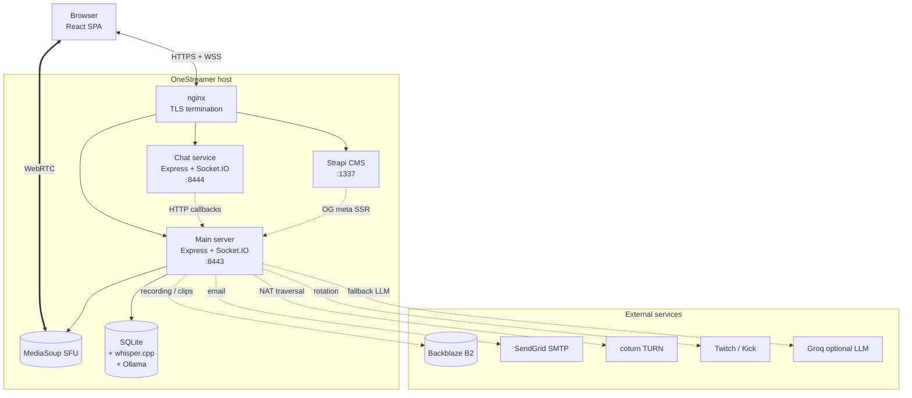

# OneStreamer

> **Self-hosted live-streaming platform with viewer takeover, an in-stream economy, AI chatbots, and real-time visual effects.**

[](LICENSE)
[](https://onestreamer.live)
[](https://nodejs.org)
[](#tech-stack)

<!-- TODO: hero screenshot or short GIF (~1280×720, save to docs/assets/hero.png). Replace this comment with:  -->

OneStreamer is a one-streamer-at-a-time live broadcast platform where viewers can take over the stream with a click, spend points they've earned on items that affect the live feed (buffs, visual effects, sound effects, AI bot summons), vote in chat to skip or extend rotations, and watch the whole thing get recorded into searchable, clippable VODs. The live instance runs at [onestreamer.live](https://onestreamer.live).

---

## What it is

- **A single-tenant self-hosted application.** One organization runs it, one community uses it.
- **Real-time first.** WebRTC streaming via MediaSoup, Socket.IO for everything else, sub-second feedback loops.
- **Opinionated about engagement.** The takeover mechanic, the points/items economy, the in-stream effects, and the chat-driven voting are all in tension with one another — that's the design.
- **Open architecture, MIT-licensed.** Read the code, fork it, run your own instance.

## What it isn't

- **A SaaS to sign up for.** [onestreamer.live](https://onestreamer.live) is one community's live instance, not a free hosting service.
- **A streaming SDK or library.** It's an application — you run it, you don't import from it.
- **Production-tested at scale.** Single Node.js process per service, single SQLite DB, single host. Wouldn't recommend running it for a million concurrent viewers without doing serious capacity work first.
- **Polished and bug-free.** A few known issues (A/V sync ~333 ms offset, dormant LiveKit infrastructure) are documented honestly — see [Known status](#known-status) below.

---

## Feature tour

### Streaming
- **One-streamer-at-a-time** with takeover request → approve/deny → handoff
- **Dual cooldowns** (global + per-user) prevent thrashing
- **WebRTC via MediaSoup SFU** (announces on a public IP, UDP 50000–50199 range)
- **HLS fallback** via hls.js when WebRTC fails
- **Streamer audio profiles**: Raw, Voice Chat, Music, Streaming — with fine-grained echo / noise / gain / sample-rate / channel control
- **Screen-share** mode in addition to camera
- See [`docs/features/streaming-and-takeover.md`](docs/features/streaming-and-takeover.md)

### Chat & moderation
- **Separate chat microservice** (port 8444) — restartable independently of streaming
- **Animal usernames** for anonymous visitors; persistent identity for authenticated users
- **Rate limits + duplicate-message detection** server-side
- **Local profanity filter** with ~600 entries, normalization for character substitution, leetspeak, and Zalgo
- **Chat-level moderation** (`!ban` / `!unban` / `!timeout` / `!remove-timeout` / `!clear-chat`) persisted to `moderation_data.json`
- **IP-level bans** across both sockets, stored in SQLite
- **Cross-cutting account bans** in the admin panel
- See [`docs/features/chat-and-moderation.md`](docs/features/chat-and-moderation.md)

### Voting & claim codes
- **Chat votes** to rotate (`!skip`), swap (`!swap <url>`), extend, reduce, lock, unlock — each with its own threshold (33–100 %), window, and cooldown
- **Single-viewer mode**: votes fire immediately when only one viewer is present
- **Random claim codes** dropped in chat at 20–60 min intervals; first user to `!claim <code>` wins points
- **Dice & coin** (`!roll`, `!flip`) + **gambling** (`!gamble`, `!slots`) move points around
- See [`docs/features/voting-and-claims.md`](docs/features/voting-and-claims.md)

### Economy: points, items, buffs
- **Points earned** for streaming (10/min), viewing (2/min), chatting (5/msg)
- **Authoritative `points_balance` column** in SQLite (the calculated-on-read system was migrated away from)
- **Shop** with admin-managed catalog, rarities, cooldowns, stack rules
- **Item types**: `buff` / `debuff` / `utility` / `guard` / `weapon` / `marker`
- **The cooldown game** — guard items extend takeover cooldowns; weapon items shrink them. Strategic depth without a separate game loop.
- See [`docs/features/points-and-economy.md`](docs/features/points-and-economy.md) and [`docs/features/items-and-buffs.md`](docs/features/items-and-buffs.md)

### Visual effects
- **VisualFX** (server-side stream manipulation): 30+ effects across resolution, bitrate, frame-rate, packet-loss, jitter, pixelate, blur, grayscale, sepia, static, glitch, voice pitch, echo, freeze-frame, stutter — plus presets (`chaos_mode`, `retro_mode`, `lag_fest`, `artistic`, `comedy_hour`)
- **CanvasFX** (client-side overlay): 10+ effects including tomato splat, confetti cannon, smoke bomb, disco ball, freeze frame, drawing mode, click-to-throw projectile, rainbow
- See [`docs/features/visualfx-and-canvasfx.md`](docs/features/visualfx-and-canvasfx.md)

### Recording & clips
- **Continuous HLS recording** of every active stream
- **Backblaze B2 upload** in background; local cleanup once confirmed
- **Synced chat capture** alongside the recording (chat replay works)
- **Admin recording review** with playback, seek, speed (0.5×–2×), and chat-replay
- **Public clip gallery** — search, sort, paginated; users extract clips from the rolling window or admins extract from recordings
- See [`docs/features/recording-and-clips.md`](docs/features/recording-and-clips.md)

### AI chatbots
- **MovieBot** — context-aware stream commentary (consumes live transcription + chat history)
- **ChatBot** — conversational participants with configurable personality / temperature / response interval
- **StreamBot** — periodic announcement bot
- **Local Ollama** (default `mistral`) with **optional Groq cloud fallback** when `GROQ_API_KEY` is set
- **Canned fallback** if both providers are unreachable, so a bot never goes silent
- See [`docs/features/ai-chatbots.md`](docs/features/ai-chatbots.md)

### Transcription
- **Real-time speech-to-text** via the bundled `whisper.cpp` native binary
- **Local-only** — no cloud STT APIs; audio never leaves the host
- **99+ languages** with model selection (`tiny` / `base` / `small` / `medium` / `large`)
- **5-second chunks** with 500 ms overlap for context
- **MovieBot consumes the transcript** for context-aware commentary
- See [`docs/features/transcription.md`](docs/features/transcription.md)

### Stream sources
- **Random Twitch rotation** via Helix API (OAuth 2.0 client credentials), filtered by viewer-range and excluded categories
- **Random Kick rotation** via a Python helper (`curl_cffi`) that bypasses bot detection
- **Arbitrary URL ingestion** for any HTTP/RTMP source
- **Viewbot fleet** (~20 service variants, one active orchestrator) with Plain RTP and WebRTC modes
- See [`docs/features/external-sources-twitch-kick.md`](docs/features/external-sources-twitch-kick.md) and [`docs/architecture/viewbot-fleet.md`](docs/architecture/viewbot-fleet.md)

### Sound effects & TTS
- **101soundboards integration** — paste any sound URL, queue and play in-stream
- **TTS items** trigger server-side text-to-speech (multiple voices)
- See [`docs/features/soundboard-and-tts.md`](docs/features/soundboard-and-tts.md)

### Multiplayer game
- **2D world overlay** with WASD movement, item pickup, enemies, respawn
- **Real-time state sync** via dedicated socket events
- **Admin-toggleable** — overlay invisible when game is off
- See [`docs/features/multiplayer-game.md`](docs/features/multiplayer-game.md)

### Admin panel
- **AdminPanelV3** — React-based, 18 tabs (Dashboard / Game / Users / Connections / ViewBots / URL Streams / Items / Chat Bots / StreamBot / Recordings / Recording Review / Transcriptions / Emojis / Chat Moderation / IP Bans / Streaming Logs / Tutorial Editor / Bug Reports)
- **Role-gated** by `is_admin` / `is_moderator` flags on the user row
- **JWT-authenticated** with the user's session token; some legacy endpoints accept the `ADMIN_KEY` env var
- See [`docs/features/admin-panel.md`](docs/features/admin-panel.md)

### Account & auth
- **Email + password** with verification email
- **Google OAuth** via Passport
- **Cloudflare Turnstile** CAPTCHA on signup, login, password reset, bug reports
- **Account deletion** with 24-hour confirmation token + 15-day grace period + automated hard-purge across 8 tables
- See [`docs/security/auth-flows.md`](docs/security/auth-flows.md) and [`docs/features/admin-panel.md`](docs/features/admin-panel.md)

---

## Quick start

```bash
git clone https://github.com/onestreamer/onestreamer.git
cd onestreamer
npm run install-all           # installs root, client, chat-service deps
cp .env.example .env          # edit; see docs/getting-started/environment-variables.md
cp server/.env.example server/.env
npm run dev                   # starts main server + chat service + React dev server
# open https://localhost:3443  (accept the self-signed cert)
```

That's the smoke-test path. The full setup — TLS certs, Whisper build, Ollama installation, real Cloudflare keys — is in **[`docs/getting-started/local-dev.md`](docs/getting-started/local-dev.md)**.

End-to-end walkthrough (signup → take over → broadcast → watch from a second browser): **[`docs/getting-started/first-stream.md`](docs/getting-started/first-stream.md)**.

---

## Architecture at a glance



**The moving parts**:

- **Three Node.js processes** managed by PM2: the main server (port 8443), the chat microservice (port 8444), the React client dev server (port 3443 in dev; static build behind nginx in prod).
- **Real-time media flows over MediaSoup** (the WebRTC SFU) directly between browsers — the server doesn't decode video, it forwards encrypted RTP. LiveKit is also installed but currently dormant.
- **SQLite is the source of truth** for users, items, points, recordings, clips, bans, transcriptions, chatbot configs, and more. ~30 tables, all in `server/data/onestreamer.db`.
- **Recording is continuous** — every stream is captured to HLS segments and uploaded to Backblaze B2 in the background. Clips are extracted from those segments.
- **A separate Strapi CMS** on port 1337 holds blog content; the main Node server fetches blog articles and server-side renders OG meta tags so links preview cleanly on Discord/Twitter.

Deeper architecture docs: **[`docs/architecture/`](docs/architecture/)**. Past design decisions live as ADRs in [`docs/architecture/adr/`](docs/architecture/adr/).

---

## Documentation map

| Section | What's there |
|---------|--------------|
| [**`docs/getting-started/`**](docs/getting-started/) | Local dev setup, first-stream walkthrough, environment-variable reference |
| [**`docs/operations/`**](docs/operations/) | Deployment, backup/restore, monitoring, upgrades, and a per-incident-class [runbook collection](docs/operations/runbooks/) |
| [**`docs/features/`**](docs/features/) | One file per user-facing feature — streaming, chat, points, items, recording/clips, transcription, AI bots, admin panel, the game, more |
| [**`docs/architecture/`**](docs/architecture/) | System overview, streaming stack, viewbot fleet, real-time events catalog, data model, service catalog, plus [ADRs](docs/architecture/adr/) |
| [**`docs/integrations/`**](docs/integrations/) | One file per external dependency — LiveKit, MediaSoup, B2, Google OAuth, Turnstile, Ollama, Groq, Whisper, 101soundboards, Twitch, Kick, Strapi, SendGrid |
| [**`docs/api/`**](docs/api/) | Complete REST endpoint reference + Socket.IO event reference |
| [**`docs/contributing/`**](docs/contributing/) | Coding conventions, branching/releases, testing, how to add a new service |
| [**`docs/security/`**](docs/security/) | Threat model, moderation policy, auth flows with sequence diagrams |
| [**`docs/archive/`**](docs/archive/) | Historical fix logs, dead planning docs, rollback notes — preserved but **not maintained** |

The top-level [`docs/README.md`](docs/README.md) is the audience-first index — pick by "what role am I playing right now" rather than by feature.

---

## Tech stack

| Layer | Choices |
|-------|---------|
| **Runtime** | Node.js 18+, Express 4, Socket.IO 4.7 |
| **Frontend** | React 19, TypeScript 4.9, `mediasoup-client`, `hls.js`, `socket.io-client`, `lucide-react`, CRA build |
| **Realtime media** | MediaSoup (primary WebRTC SFU), coturn (TURN/STUN), LiveKit (installed but dormant — see [ADR-0002](docs/architecture/adr/0002-mediasoup-primary-livekit-dormant.md)) |
| **Media tooling** | ffmpeg, GStreamer, Puppeteer / Chrome for WebRTC-mode viewbots |
| **Storage** | SQLite (primary), Backblaze B2 (recording + clip storage via the S3-compatible API), optional Redis (cache) |
| **Auth** | Passport (Google OAuth + Local), JWT (`jsonwebtoken`), Cloudflare Turnstile, bcrypt |
| **CMS** | Strapi 4 (blog content, separate process) |
| **AI / ML** | Ollama (local, default `mistral`), Groq (optional cloud LLM), `whisper.cpp` (local STT, no cloud APIs) |
| **Email** | SendGrid SMTP via `nodemailer` |
| **Process management** | PM2 |
| **Reverse proxy** | nginx with Let's Encrypt TLS |

Full per-dependency notes in [`docs/integrations/`](docs/integrations/).

---

## Known status

OneStreamer is actively used in production but has accumulated some honest debt. Where status matters, individual docs carry `> [!WARNING]` banners. The highlights:

- **A/V sync ~333 ms offset.** Audio and video are carried over separate RTP streams without RTCP sender-report synchronization. Architectural limitation; not currently prioritized for fix. See [`docs/architecture/streaming-stack.md`](docs/architecture/streaming-stack.md) and the archived investigation in [`docs/archive/av-sync/`](docs/archive/av-sync/).
- **LiveKit infrastructure is dormant.** A September 2025 dual-stack attempt was rolled back the same day after networking issues; the LiveKit server still runs at `livekit.onestreamer.live` but no production path uses it. See [ADR-0002](docs/architecture/adr/0002-mediasoup-primary-livekit-dormant.md) and [ADR-0003](docs/architecture/adr/0003-livekit-dual-stack-rollback.md).
- **Stream-reliability plan partially executed.** The most critical fix (`currentStreamer` dual-source-of-truth) shipped; transport-recreation race conditions and `stream-ready` event de-duplication remain TODO. See the archived [`STREAM_RELIABILITY_PLAN.md`](docs/archive/plans/STREAM_RELIABILITY_PLAN.md).
- **`openai-whisper` was a phantom dependency.** Listed in `package.json` but unused — removed in #21. The live transcription path is `whisper.cpp`. See [ADR-0006](docs/architecture/adr/0006-whisper-cpp-over-cloud-stt.md).

---

## Contributing

Pull requests welcome. Conventions, branch naming, test runs, and the PR template are documented in [`CONTRIBUTING.md`](CONTRIBUTING.md) and [`docs/contributing/`](docs/contributing/).

Three habits keep these docs alive:

1. **Write an ADR** when you make a non-trivial design decision — template in [`docs/architecture/adr/README.md`](docs/architecture/adr/README.md).
2. **Write a runbook** when you debug something gnarly — template in [`docs/operations/runbooks/README.md`](docs/operations/runbooks/README.md).
3. **Tick the doc-update checkbox** in the PR template before merging.

Only six markdown files belong at the repo root: `README.md`, `CONTRIBUTING.md`, `SECURITY.md`, `CHANGELOG.md`, `LICENSE`, `CLAUDE.md`. Everything else lives in `docs/`.

## Security

Vulnerability disclosures go to the maintainer email listed in [`SECURITY.md`](SECURITY.md). Please don't open public issues for security topics.

## License

MIT — see [`LICENSE`](LICENSE).
