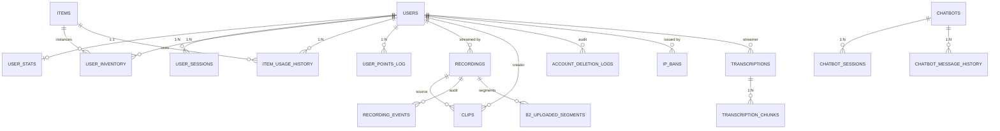

# Data model

_Last verified: 2026-06-01 against `main`._

OneStreamer persists its state in a single SQLite database at `server/data/onestreamer.db`. ~40 tables, all in one file. The boot schema has a single source ([ADR-0030](adr/0030-single-source-schema-ddl.md)): [`server/database/schema.js`](../../server/database/schema.js), invoked by [`server/database/database.js`](../../server/database/database.js) at boot. The remaining `.sql` files in [`server/database/`](../../server/database/) (`url-stream-schema.sql`, `url-relay-whitelist-schema.sql`, `ai-moderation-schema.sql`) are service-owned isolated schemas applied by their owning services. Incremental changes run through a lightweight migration runner in [`server/migrations/`](../../server/migrations/) ([ADR-0022](adr/0022-schema-migrations-layout.md)).

This page describes the key entities and how they relate. The full schema is in code — this is the navigable summary.

## Core entities



## Account & identity

### `users`

The root entity for everything user-shaped.

```sql
id                       INTEGER PRIMARY KEY
email                    TEXT UNIQUE
username                 TEXT UNIQUE
password_hash            TEXT             -- bcrypt; NULL for OAuth-only accounts
google_id                TEXT UNIQUE      -- NULL for non-OAuth accounts
is_verified              BOOLEAN          -- email-verified
is_admin                 BOOLEAN
is_moderator             BOOLEAN
is_banned                BOOLEAN
account_status           TEXT             -- 'active' | 'pending_deletion' | 'deleted'
avatar_url               TEXT
description              TEXT
created_at               DATETIME
-- Account deletion lifecycle:
deletion_requested_at    DATETIME
deletion_confirmed_at    DATETIME
deletion_scheduled_for   DATETIME         -- = confirmed_at + 15 days
deletion_token           TEXT             -- 24h crypto.randomBytes
deletion_token_expires   DATETIME
```

Lifecycle: see [`/docs/features/admin-panel.md`](../features/admin-panel.md#account-deletion-cross-cutting-feature) for the full deletion state machine.

### `user_sessions`

IP-keyed session continuity, so a returning user reconnecting from the same IP is recognized before they re-authenticate.

```sql
id           INTEGER PRIMARY KEY
user_id      INTEGER NULL          -- NULL for anonymous sessions
ip_address   TEXT
created_at   DATETIME
last_seen_at DATETIME
```

### `ip_to_user_transfers`

Audit trail of IP → user reassignments (e.g. an anonymous session graduates to authenticated when the same IP signs up).

### `user_stats`

Per-user aggregated statistics + authoritative points balance.

```sql
user_id              INTEGER PRIMARY KEY REFERENCES users(id)
total_stream_time    INTEGER DEFAULT 0    -- seconds streaming
total_view_time      INTEGER DEFAULT 0    -- seconds viewing
chat_message_count   INTEGER DEFAULT 0
points_balance       INTEGER DEFAULT 0    -- ← authoritative since the points refactor
last_streamed_at     DATETIME
last_viewed_at       DATETIME
```

> [!NOTE]
> The authoritative points column is `points_balance`. The legacy `points` column (a remnant of the pre-refactor "calculate-on-read" system) was dropped in May 2026 once the calculated-on-read code paths were verified gone. See [`/docs/features/points-and-economy.md`](../features/points-and-economy.md) and the historical context in [`/docs/archive/points/`](../archive/points/).

### `account_deletion_logs`

Audit trail for the deletion state machine. Recorded at request, confirmation, restore, and permanent-delete events. Kept even after the parent `users` row is anonymized.

```sql
id           INTEGER PRIMARY KEY
user_id      INTEGER
action       TEXT          -- 'requested' | 'confirmed' | 'restored' | 'permanently_deleted'
ip_address   TEXT
user_agent   TEXT
metadata     JSON
created_at   DATETIME
```

### `ip_bans`

```sql
id                     INTEGER PRIMARY KEY
ip_address             TEXT UNIQUE NOT NULL
banned_by_user_id      INTEGER REFERENCES users(id)
banned_by_username     TEXT
banned_at              DATETIME DEFAULT CURRENT_TIMESTAMP
reason                 TEXT
permanent              BOOLEAN DEFAULT 1
expires_at             DATETIME      -- NULL if permanent
```

Checked at socket connect (both main and chat sockets) by [`IPBanService`](../../server/services/IPBanService.js). The service keeps an in-memory cache for fast lookup.

### `streaming_logs`

Audit trail of stream connect / disconnect / takeover events. Filterable from the admin panel.

---

## Economy: items, inventory, points

### `items`

The catalog of buyable / usable items.

```sql
id                    INTEGER PRIMARY KEY
name                  TEXT UNIQUE        -- internal name; e.g. '101soundboards'
display_name          TEXT               -- shown in UI
emoji                 TEXT
description           TEXT
item_type             TEXT CHECK(item_type IN ('buff','debuff','utility','guard','weapon','marker'))
rarity                TEXT               -- common/uncommon/rare/epic/legendary
category              TEXT               -- for grouping in the shop
base_price            INTEGER            -- in points
cooldown_seconds      INTEGER
duration_seconds      INTEGER            -- for time-bounded effects
max_stack             INTEGER            -- inventory stack limit (or NULL for unlimited)
max_purchase          INTEGER            -- per-user purchase cap
effect_data           JSON               -- type-specific config (visual fx ID, soundboard provider, buff magnitude, etc.)
stack_behavior        TEXT               -- 'replace' | 'extend' | 'stack'
created_at            DATETIME
```

### `user_inventory`

What each user owns. Stack-counted, not row-per-instance.

```sql
id              INTEGER PRIMARY KEY
user_id         INTEGER REFERENCES users(id)
item_id         INTEGER REFERENCES items(id)
quantity        INTEGER
acquired_at     DATETIME
last_used_at    DATETIME              -- for per-item cooldown tracking
```

### `item_usage_history`

Every item use, for audit + analytics.

### `user_points_log`

Every points debit/credit event. The `points_balance` column on `user_stats` is the running total; this log is the journal.

---

## Recording & clips

### `recordings`

One row per recorded stream session.

```sql
id                  INTEGER PRIMARY KEY
stream_id           TEXT
streamer_id         INTEGER REFERENCES users(id)
start_time          DATETIME
end_time            DATETIME
duration            INTEGER             -- seconds
file_path           TEXT                -- local FS path while present
file_size           INTEGER             -- bytes
quality_profile     TEXT                -- '480p' | '720p' | '1080p'
format              TEXT                -- 'hls' typically
status              TEXT                -- 'active' | 'processing' | 'completed' | 'failed'
compression_status  TEXT
thumbnail_path      TEXT
metadata_json       JSON
created_at          DATETIME
```

### `recording_events`

Per-recording audit trail (start, segment-written, B2-uploaded, compress-started, compress-done, deleted, etc.).

### `recording_settings`

Key-value config — defaults pulled from here at runtime.

### `b2_uploaded_segments`

Tracks per-segment B2 upload state — used to know when local files can be cleaned up.

```sql
id              INTEGER PRIMARY KEY
recording_id    INTEGER REFERENCES recordings(id)
segment_name    TEXT
b2_key          TEXT
uploaded_at     DATETIME
size_bytes      INTEGER
```

### `clips`

User-extractable portions of recordings (or the rolling live buffer).

```sql
id                  INTEGER PRIMARY KEY
clip_id             TEXT UNIQUE         -- user-visible UUID
recording_id        INTEGER NULL REFERENCES recordings(id)
user_id             INTEGER             -- creator
streamer_user_id    INTEGER             -- who was streaming at the time
title               TEXT
description         TEXT
start_time_ms       INTEGER
end_time_ms         INTEGER
duration_ms         INTEGER
file_path           TEXT
file_size           INTEGER
thumbnail_path      TEXT
status              TEXT                -- 'processing' | 'ready' | 'failed'
view_count          INTEGER DEFAULT 0
is_public           BOOLEAN DEFAULT 0
created_at          DATETIME
updated_at          DATETIME
```

### `clip_views`

Per-view counter for popularity sorting in the gallery.

---

## Transcription

### `transcriptions`

One row per transcription session (typically maps to one stream).

```sql
id            TEXT PRIMARY KEY        -- session ID (UUID)
stream_id     TEXT
streamer_id   INTEGER REFERENCES users(id)
start_time    DATETIME
end_time      DATETIME
language      TEXT
model         TEXT                    -- 'tiny' | 'base' | 'small' | 'medium' | 'large'
word_count    INTEGER
status        TEXT                    -- 'active' | 'completed' | 'failed'
```

### `transcription_chunks`

Each 5-second window is one row.

```sql
id                  INTEGER PRIMARY KEY
transcription_id    TEXT REFERENCES transcriptions(id)
chunk_number        INTEGER
text                TEXT
timestamp           DATETIME            -- when the chunk was processed
word_count          INTEGER
```

### `transcription_events`

Audit trail (start, chunk-done, error, stop).

### `transcription_settings`

Global config (default model, default language, enable flag).

---

## Chatbots

### `chatbots`

```sql
id                       INTEGER PRIMARY KEY
name                     TEXT
prompt                   TEXT                -- the system prompt
is_enabled               BOOLEAN
response_interval_min    INTEGER             -- seconds
response_interval_max    INTEGER             -- seconds
temperature              REAL
show_robot_emoji         BOOLEAN
personality_traits       JSON                -- {enthusiasm, casual, supportive, humorous, curious}
llm_model                TEXT                -- which model to call
created_at               DATETIME
```

### `chatbot_sessions`

A bot's active connection. Bots open chat-service sockets just like real users; this table tracks their identities.

```sql
chatbot_id      INTEGER REFERENCES chatbots(id)
socket_id       TEXT
username        TEXT
color           TEXT
connected_at    DATETIME
last_message_at DATETIME
```

### `chatbot_message_history`

Every bot message, with the context (last N chat lines) that produced it.

### `chatbot_config`

Global LLM prompt config (system-wide preamble prepended to per-bot prompts).

### `streambot_messages`

Schedule of preset messages for the announcement bot.

### `streambot_settings`

Bot-on/off, message frequency.

---

## Viewbots

### `url_streams`

External-URL ingest configs (the live viewbot path is URL relay → LiveKit ingress — see [`viewbot-fleet.md`](viewbot-fleet.md)). Schema in [`server/database/url-stream-schema.sql`](../../server/database/url-stream-schema.sql). The standalone `viewbot-schema.sql` file was removed in the post-ADR-0024 cleanup along with the old file-based viewbot fleet.

---

## Bug reports

### `bug_reports`

```sql
id           INTEGER PRIMARY KEY
user_id      INTEGER NULL              -- NULL for anonymous reports
title        TEXT
description  TEXT
status       TEXT                      -- 'open' | 'in_progress' | 'resolved' | 'closed'
metadata     JSON                      -- browser, URL, IP
created_at   DATETIME
updated_at   DATETIME
```

---

## What's *not* in SQLite

A few important pieces of state live outside the DB:

- **Chat messages** — last 3,000 in memory in chat-service; lost on restart.
- **Vote tallies + claim-code state** — in-memory in chat-service; lost on restart.
- **Chat moderation (bans, timeouts)** — `chat-service/moderation_data.json` on disk.
- **LiveKit room / track state** — held by the LiveKit server (and mirrored in the main server's `StreamService`); not persisted to SQLite.
- **Whisper model files** — `whisper/models/*.bin` (not in git; downloaded separately).
- **Recording segments** — local FS in `egress-recordings/`, then Backblaze B2.
- **Clip videos** — local FS in `clips/`, optionally B2.
- **Uploaded avatars + emojis** — `uploads/` directory (gitignored).

---

## Migrations

The base schema is created programmatically on first boot by [`server/database/schema.js`](../../server/database/schema.js) (the sole boot DDL source, [ADR-0030](adr/0030-single-source-schema-ddl.md)), invoked from [`server/database/database.js`](../../server/database/database.js). Incremental changes run through a lightweight migration runner ([ADR-0022](adr/0022-schema-migrations-layout.md)): [`server/migrations/_runner.js`](../../server/migrations/_runner.js) executes the timestamped `2026MMDDHHMM-<description>.js` modules in lexicographic order on boot. Each migration exports `run(db, logger)` and is idempotent (there is no `schema_migrations` tracking table — at single-host scale a re-applied idempotent `ADD COLUMN` is cheap). A handful of older standalone scripts (`add_*`, `migrate-*`) remain and are run manually.

| Script | Purpose |
|--------|---------|
| `2026MMDDHHMM-*.js` (runner-managed) | Timestamped incremental migrations applied automatically on boot — e.g. `…-users-add-admin-flags.js`, `…-user-stats-drop-legacy-points.js`, `…-recordings-add-session-and-user.js`, `…-url-relay-add-preferred-languages.js`. |
| `migrate-points-system.js` | The calculated-on-read → authoritative-balance refactor for `user_stats.points`. |
| `add_ip_bans.js` | `ip_bans` table |
| `add_ai_moderation_tables.js` | AI moderation tables ([ADR-0013](adr/0013-ai-moderation-pipeline.md)) |
| `add-summon-bot-support.js`, `add-auto-summon-bot.js`, etc. | Per-feature column additions |

The runner applies its migrations automatically on boot; older standalone scripts are run manually after an upgrade. There is no rollback tooling — back up the DB first.

## Operational notes

- **Schema is read-once at boot.** A new column won't appear without restarting the main server.
- **No foreign-key enforcement** is enabled in SQLite (`PRAGMA foreign_keys = OFF` by default). Relationships in the diagram above are logical, not constraint-enforced. Orphan rows are possible if a hard-delete bypasses the cascade logic in `AccountService.permanentlyDeleteAccount()`.
- **Backup is important.** Single file means `cp server/data/onestreamer.db server/data/onestreamer.db.backup-$(date +%F)` is the whole backup. See [`/docs/operations/backup-restore.md`](../operations/backup-restore.md).
- **SQLite write contention** — three Node processes all touching the same file. WAL mode mitigates but doesn't eliminate; long-running write transactions block readers.

## See also

- [`overview.md`](overview.md) — where SQLite fits in the broader stack
- [`/docs/operations/backup-restore.md`](../operations/backup-restore.md) — backup procedure
- [`/docs/features/points-and-economy.md`](../features/points-and-economy.md) — the points refactor history
- [`/docs/features/admin-panel.md`](../features/admin-panel.md) — account deletion full lifecycle
- [`service-catalog.md`](service-catalog.md) — the services that read and write these tables
