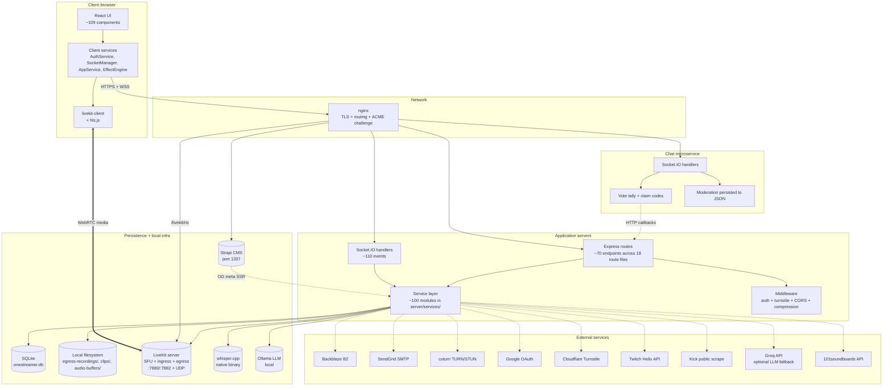

# System architecture overview

_Last verified: 2026-06-01 against `main` (post-ADR-0024 cleanup)._

The README has a top-level "what talks to what" diagram. This page goes deeper: the layers, the trust boundaries, the lifecycle of a request, and the rationale for the major splits. **LiveKit is the sole WebRTC backend** ([ADR-0024](adr/0024-retire-mediasoup-livekit-only.md)); MediaSoup is fully retired.

## The layered view

## The five major splits

### 1. Browser ↔ server is HTTPS + WSS over nginx; WebRTC media goes to LiveKit

nginx terminates TLS for application traffic on ports 80/443 and proxies to:
- Main server on `127.0.0.1:8443`
- Chat-service on `127.0.0.1:8444`
- Strapi on `127.0.0.1:1337`
- LiveKit on `127.0.0.1:7882` (the sole WebRTC backend — primary streamer↔viewer, URL-stream relay via ingress, recording via egress, transcription; see [ADR-0024](adr/0024-retire-mediasoup-livekit-only.md))

**Media flows browser ↔ LiveKit.** The RTC signaling WebSocket is proxied by nginx (`/livekit/rtc`, with `Upgrade`/`Connection` headers + 7-day timeouts); the actual A/V RTP rides LiveKit's UDP port range (set in `livekit-config.yaml`), announced on the public IP. This direct media path is why `coturn` exists as a TURN relay for clients behind strict NATs.

### 2. Main server vs chat-service — one host, two processes

Chat is a separate Node process (port 8444) with its own Socket.IO instance, JWT validation (shared `JWT_SECRET`), and persistence model (in-memory + a single `moderation_data.json` file on disk). When chat-service crashes or restarts, streaming continues unaffected. See [ADR-0004](adr/0004-chat-service-as-separate-microservice.md).

Chat-service calls back to the main server over HTTP for any cross-cutting side effects (award points after a winning `!claim`, trigger a stream rotation after a `!skip` vote, fire a TTS, etc.). The main server treats chat-service as a trusted client; some internal endpoints (`/api/internal/*`) accept its JWT directly.

### 3. SQLite is the source of truth; B2 is the storage tier

~30 SQLite tables in `server/data/onestreamer.db` hold everything stateful: users, inventory, points balance, recordings metadata, chatbot configs, IP bans, transcription chunks, account-deletion audit, etc. See [`data-model.md`](data-model.md).

Recording video segments are not stored in SQLite — they're written to the local filesystem first (`egress-recordings/{sessionId}/`), then uploaded to Backblaze B2 in the background by [`RecordingUploadScheduler`](../../server/services/RecordingUploadScheduler.js). The metadata in SQLite tracks both copies. See [ADR-0005](adr/0005-b2-over-direct-s3.md).

### 4. AI runs locally by default

Whisper transcription runs the bundled native binary `whisper.cpp/main` via `child_process` — no cloud STT, no audio leaving the host. LLM for chatbots defaults to local Ollama (running `mistral`), with Groq as an optional cloud fallback if `GROQ_API_KEY` is set, and a hardcoded canned-response set if both are unreachable. See [ADR-0006](adr/0006-whisper-cpp-over-cloud-stt.md).

### 5. Strapi is a separate product the React app doesn't know exists

The blog (`/blog/<slug>`) is content from Strapi CMS on `:1337`. The React SPA has zero references to Strapi. Instead, nginx routes `/blog/<slug>` requests to the main server, which fetches the article metadata from Strapi's REST API and server-side renders the OG meta tags into the HTML response. The point is to make Discord/Twitter previews look good; the actual blog rendering still happens client-side from the resulting HTML. See [`/docs/integrations/strapi.md`](../integrations/strapi.md).

## Trust boundaries

| Boundary | What crosses | How it's gated |
|----------|--------------|----------------|
| Browser → main server | HTTPS REST + WSS sockets | JWT (Bearer header on REST; auth handshake on sockets) + Cloudflare Turnstile for signup/login/some chat actions + IP-ban check at socket connect |
| Browser → LiveKit | WebRTC RTP | LiveKit access token (minted server-side by `LiveKitService`); DTLS + ICE negotiated by the LiveKit SDK |
| Browser → chat-service | WSS sockets | Same JWT as main server (shared `JWT_SECRET`); IP-ban check |
| Chat-service → main server | HTTP callbacks | Bearer JWT (the user's) + shared trust; `/api/internal/*` paths |
| Main server → Strapi | HTTP fetch | Localhost; no auth (Strapi is bound to 127.0.0.1) |
| Main server → external services | HTTPS | API keys per provider; see [`/docs/integrations/`](../integrations/) and [`/docs/operations/runbooks/secret-rotation.md`](../operations/runbooks/secret-rotation.md) |
| Admin actions | Same channels as users | `is_admin` / `is_moderator` flag check in [`server/middleware/auth.js`](../../server/middleware/auth.js); legacy paths additionally accept `ADMIN_KEY` env var |

## Lifecycle of a typical request

### A viewer loading the site
1. Browser hits `https://onestreamer.live/` → nginx serves the React static bundle.
2. React opens two Socket.IO connections: one to the main server (`/socket.io/`), one to chat (`/chat/socket.io/`).
3. Sockets connect with the user's JWT if logged in, anonymously otherwise. Server checks IP ban, assigns anonymous animal-username if no JWT, emits `stream-status` + chat history.
4. If a stream is live, the client connects to the LiveKit room (token minted by the server) and subscribes to the streamer's tracks — RTP media starts flowing over UDP.

### A viewer becoming the streamer
1. Browser emits `request-to-stream`.
2. Server checks cooldowns + ban status + current streamer.
3. If approved, server emits `streaming-approved`.
4. The client connects to the LiveKit room ([`LiveKitClient`](../../client/src/services/LiveKitClient.ts)) and publishes its audio + video tracks; ICE/SDP is negotiated inside the LiveKit SDK, not on the socket.
5. Server broadcasts `stream-ready` then `stream-started` to all viewers.
6. Other viewers' clients subscribe to the new publisher's LiveKit tracks, swap their video element source.
7. [`ContinuousRecordingService`](../../server/services/ContinuousRecordingService.js) starts a LiveKit Egress capturing HLS segments in the background.

### A viewer using an item
1. Browser POSTs to `/api/inventory/use/:itemId` with the user's JWT.
2. Server looks up item type, dispatches: buff/debuff → [`BuffDebuffService`](../../server/services/BuffDebuffService.js); utility → varies (TTS, soundboard, visual effect, summon bot); cooldown modifier → [`TakeoverService`](../../server/services/TakeoverService.js).
3. Server updates `user_inventory`, broadcasts the effect via socket events to all clients.
4. Client UIs update — the streamer sees a buff icon, viewers see a canvas effect, chat sees a system message, etc.

## Process management

All three Node services are PM2-managed via [`config/ecosystem.config.js`](../../config/ecosystem.config.js):

| App | Script | Memory cap |
|-----|--------|------------|
| `onestreamer-server` | `./server/index.js` | 2 GB |
| `onestreamer-chat` | `./chat-service/index.js` | 1 GB |
| `onestreamer-client` | `npm start` in `client/` | 2 GB |

(Notable: in production the React `client` dev server runs alongside, not just the static build. This is a quirk worth being aware of.)

Plus the external companions:

| Process | Where |
|---------|-------|
| nginx | system service |
| Strapi CMS | separate process; not in `config/ecosystem.config.js` (typically systemd or its own PM2 entry) |
| LiveKit server | system service on `:7880` / `:7882` (the WebRTC backend — streamer↔viewer, URL-stream relay, recording, transcription; see ADR-0024) |
| coturn | system service |
| Ollama | system service on `:11434` |

`pm2 start config/ecosystem.config.js` is the canonical way to bring the three Node apps up; `scripts/deploy/start-production.sh` wraps it with cert + nginx checks for deploys and recovery.

## What's intentionally single-host

OneStreamer is not currently designed for horizontal scaling. There is no Redis-backed session, no shared message bus between would-be replicas, and the single LiveKit server runs co-located on the host. The codebase has Redis support but it's optional and unused in production. Scaling beyond a single host would require:

- Sticky session routing for sockets (or shared session backend)
- A distributed LiveKit deployment (separate nodes / a LiveKit cluster) instead of the single co-located server
- Shared moderation state for the chat-service (currently in-memory + local JSON)
- Read-replica or shared SQLite-alternative for the DB

None of this is on the roadmap.

## See also

- [`streaming-stack.md`](streaming-stack.md) — the real-time media pipeline in detail
- [`viewbot-fleet.md`](viewbot-fleet.md) — the ~20 viewbot variants and how they ingest external streams
- [`realtime-events.md`](realtime-events.md) — full Socket.IO event catalog
- [`data-model.md`](data-model.md) — SQLite schemas and relationships
- [`service-catalog.md`](service-catalog.md) — every file in `server/services/`
- [`adr/`](adr/) — the *why* behind these architectural choices
- [`adr/0010-url-relay-whitelist-mode.md`](adr/0010-url-relay-whitelist-mode.md) — URL-relay content filter (active)
- [`plans/url-relay-whitelist-mode.md`](plans/url-relay-whitelist-mode.md) — the 6-phase rollout plan, all phases shipped
