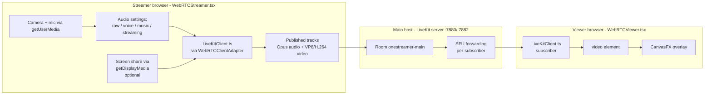
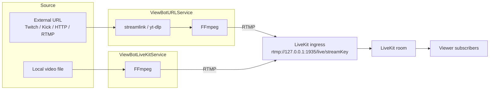

# Streaming stack

_Last verified: 2026-06-01 against `main` (post-ADR-0024 cleanup)._

How real-time A/V moves through OneStreamer: from a streamer's webcam, through **LiveKit**, to viewer browsers — plus the secondary pipelines (recording, transcription) and the viewbot ingest path that feed off the same LiveKit room. [LiveKit](https://livekit.io/) is the **sole WebRTC backend** ([ADR-0024](adr/0024-retire-mediasoup-livekit-only.md)); MediaSoup and its Plain-RTP/GStreamer/Puppeteer machinery are gone.

## The primary path (streamer → viewer)



**Application** signaling (who's the streamer, takeover handshake, `stream-ready`/`stream-started`) flows over Socket.IO on the main server (`:8443`). **Transport** signaling (ICE candidates, SDP, DTLS) flows inside the LiveKit client SDK directly against the LiveKit server — it is *not* on the OneStreamer socket. The client uses the application `stream-ready`/`streaming-approved` signal as its cue to connect to the LiveKit room and publish or subscribe. See [`realtime-events.md`](realtime-events.md).

Client wiring: [`client/src/services/LiveKitClient.ts`](../../client/src/services/LiveKitClient.ts) wraps a LiveKit `Room`; the React stream components reach it through the thin [`WebRTCClientAdapter.ts`](../../client/src/services/WebRTCClientAdapter.ts) shim so they never import the LiveKit class directly. Server-side, [`LiveKitService.js`](../../server/services/LiveKitService.js) holds the `RoomServiceClient` (room/token management) and the ingress/egress clients.

### Why LiveKit (and why a SFU)

[ADR-0024](adr/0024-retire-mediasoup-livekit-only.md). LiveKit had already carried all production traffic — primary streamer→viewer, URL-stream relay (ingress), recording (egress), and transcription — since [ADR-0008](adr/0008-revive-livekit-for-url-streams-and-recording.md); ADR-0024 retired the never-exercised MediaSoup fallback to leave a single stack.

LiveKit is a Selective Forwarding Unit: the server receives one set of tracks from the streamer and forwards them to N subscribers without decoding/re-encoding. Compared to P2P mesh this scales to many viewers without exploding the streamer's upload; compared to an MCU it adds near-zero CPU and no re-encode latency. The trade-off — no server-side transcoding-per-viewer or stream-merging — is a deliberate non-goal.

## Secondary pipelines (recording, transcription)

Beyond the streamer → viewer flow, the LiveKit room feeds two independent server-side consumers:

```mermaid
flowchart TB
    Room[LiveKit room<br/>streamer tracks]

    Room --> Subs[Viewer subscribers<br/>primary path]

    Room -->|Egress| Egress[LiveKit Egress<br/>Room Composite / Participant]
    Egress --> HLS[HLS segments<br/>egress-recordings/sessionId/]
    HLS --> Sessions[(recording_sessions)]
    HLS --> Upload[RecordingUploadScheduler<br/>background B2 upload]
    Upload --> B2[(Backblaze B2)]
    HLS --> Cleanup[RecordingCleanupScheduler<br/>local delete after upload]

    Room -->|RTC subscribe| RTC[TranscriptionAudioAdapter<br/>@livekit/rtc-node AudioStream]
    RTC --> PCM[PCM 16-bit frames -> .pcm -> .wav]
    PCM --> Whisper[WhisperRunner<br/>whisper.cpp/main]
    Whisper --> Chunks[(transcription_chunks)]
    Whisper --> SocketEvt[transcription-update<br/>socket broadcast]
    SocketEvt --> MovieBot[MovieBot / VisionBot context]
    SocketEvt --> Captions[Optional viewer captions]
```

- **Recording** — [`ContinuousRecordingService`](../../server/services/ContinuousRecordingService.js) starts a LiveKit **Egress** (Room Composite for viewbots, Participant Egress for a real streamer) that writes HLS segments to `egress-recordings/{sessionId}/`. [`RecordingUploadScheduler`](../../server/services/RecordingUploadScheduler.js) pushes them to B2; [`RecordingCleanupScheduler`](../../server/services/RecordingCleanupScheduler.js) deletes local copies once upload is confirmed; [`recording/RecordingDiskScanner`](../../server/services/recording/RecordingDiskScanner.js) reconciles disk against the `recording_sessions` table. Chat is timestamped to the segment timeline by [`SessionChatCaptureService`](../../server/services/SessionChatCaptureService.js). Review surface: `/admin/review/*`.
- **Transcription** — [`TranscriptionAudioAdapter`](../../server/services/TranscriptionAudioAdapter.js) subscribes to the streamer's audio track via `@livekit/rtc-node` (`Room` → `AudioStream`, `TrackKind.KIND_AUDIO`), writes the PCM frames to a `.pcm`/`.wav` buffer in 5-second windows (0.5 s overlap), and [`WhisperRunner`](../../server/services/transcription/WhisperRunner.js) transcribes each with `whisper.cpp/main`. See [`/docs/features/transcription.md`](../features/transcription.md).

These pipelines are independent: transcription off doesn't stop recording, recording off doesn't stop transcription, and neither affects the primary viewer path.

## Viewbot ingest (the other direction)

Viewbots are "synthetic streamers" — an external URL or a local video pushed into a LiveKit room as if it were a real broadcaster. Both paths terminate in a LiveKit **ingress**:



There is no Plain-RTP/WebRTC mode toggle anymore — every viewbot is a LiveKit ingress. Rotation is gated by [`SimpleViewBotRotation`](../../server/services/SimpleViewBotRotation.js) (real-streamer / URL-relay protection) and driven by [`RandomStreamRotationService`](../../server/services/RandomStreamRotationService.js). Full detail in [`viewbot-fleet.md`](viewbot-fleet.md).

## Codec choices

| Track | Codec | Notes |
|-------|-------|-------|
| Audio | **Opus** (48 kHz; 16 kHz mono for the Voice Chat preset) | Profile selected in [`AudioOptimizationService`](../../server/services/AudioOptimizationService.js); published by the LiveKit client |
| Video | **VP8 / H.264** as negotiated by LiveKit | LiveKit handles codec negotiation + (optional) simulcast layers |
| Recording output | **HLS segments** from LiveKit Egress | Encoded by LiveKit Egress, not by the app |
| Transcription input | **PCM 16-bit mono** | Decoded from the LiveKit audio track by `@livekit/rtc-node`; whisper.cpp requirement |

## Port footprint

| Port | Protocol | What |
|------|----------|------|
| 80 | TCP | nginx HTTP → 301 redirect to HTTPS, plus ACME challenge |
| 443 | TCP | nginx HTTPS application traffic (proxies to :8443, :8444, :1337, :7882) |
| 8443 | TCP | Main server HTTPS (behind nginx) |
| 8444 | TCP | Chat-service HTTPS (behind nginx) |
| 3443 | TCP | React dev server (dev only; behind nginx in prod) |
| 1337 | TCP | Strapi CMS (localhost-only) |
| 7880 | TCP | LiveKit HTTP API |
| 7882 | TCP/WS | LiveKit RTC signaling (WebSocket; proxied via nginx `/livekit/rtc`) |
| 1935 | TCP | LiveKit RTMP ingress (localhost; viewbots/URL relay push here) |
| 11434 | TCP | Ollama (localhost) |
| **(LiveKit UDP range)** | **UDP** | **LiveKit RTC/ICE media — the range configured in `livekit-config.yaml` (`rtc.port_range_start/end` + `rtc.udp_port`) must be reachable from the public internet for media** |
| 3478, 5349 | UDP/TCP | coturn TURN/STUN |

## NAT traversal

LiveKit performs ICE the same way any WebRTC stack does:

1. **Direct** — host/server-reflexive candidates when both ends have a routable path to the LiveKit RTC port on the announced IP.
2. **TURN relay via coturn** — for clients behind symmetric NAT, double-NAT, mobile CGNAT, or restrictive firewalls. LiveKit can also be configured with its own embedded TURN (`LIVEKIT_TURN_ENABLED`), but coturn is the primary relay.

The coturn credential pattern is HMAC-based with a shared secret (`TURN_SECRET`); the historical hardcoded-fallback caveat is tracked in [`/docs/operations/runbooks/secret-rotation.md`](../operations/runbooks/secret-rotation.md).

## Limits and known gaps

| Item | Status | Workaround |
|------|--------|------------|
| Single LiveKit server per host | By design (single-host) | Scale vertically; LiveKit supports a distributed deployment but that's new infra |
| No in-process WebRTC fallback | Accepted ([ADR-0024](adr/0024-retire-mediasoup-livekit-only.md)) | Recovery from a LiveKit-class outage is redeploy of the tagged pre-retirement build, not an env flip |
| HLS fallback path | Implemented but not primary | Default is WebRTC; HLS is only when WebRTC fails to negotiate |
| LiveKit `devkey`/`secret` defaults in some environments | Security caveat | Rotate `LIVEKIT_API_KEY`/`LIVEKIT_API_SECRET`; see [`/docs/integrations/livekit.md`](../integrations/livekit.md) + secret-rotation runbook |
| Recording → B2 upload back-pressure | Local files accumulate if B2 upload fails | Monitor `egress-recordings/` size; see [`/docs/operations/runbooks/recording-upload-failed.md`](../operations/runbooks/recording-upload-failed.md) |
| Ingress "not connected" | RTMP never reached LiveKit ingress | See [`/docs/operations/runbooks/livekit-ingress-not-connected.md`](../operations/runbooks/livekit-ingress-not-connected.md) |

## Code paths

| Concern | File |
|---------|------|
| LiveKit room / token / ingress / egress management | [`server/services/LiveKitService.js`](../../server/services/LiveKitService.js) |
| LiveKit + streaming config | [`server/config/webrtc.config.js`](../../server/config/webrtc.config.js) (the `livekit` block) |
| Streamer state / source of truth | [`server/services/StreamService.js`](../../server/services/StreamService.js) |
| Takeover handshake | [`server/services/TakeoverService.js`](../../server/services/TakeoverService.js), [`server/sockets/streamHandler/takeover.js`](../../server/sockets/streamHandler/takeover.js) |
| Streaming-backend bootstrap | [`server/bootstrap/start-streaming-backend.js`](../../server/bootstrap/start-streaming-backend.js) |
| URL-relay ingest | [`server/services/ViewBotURLService.js`](../../server/services/ViewBotURLService.js), [`urlstream/FFmpegPipeline.js`](../../server/services/urlstream/FFmpegPipeline.js) |
| Local-video ingest | [`server/services/ViewBotLiveKitService.js`](../../server/services/ViewBotLiveKitService.js) |
| Recording (egress) | [`server/services/ContinuousRecordingService.js`](../../server/services/ContinuousRecordingService.js) |
| Transcription capture | [`server/services/TranscriptionAudioAdapter.js`](../../server/services/TranscriptionAudioAdapter.js), [`transcription/WhisperRunner.js`](../../server/services/transcription/WhisperRunner.js) |
| Audio codec/profile config | [`server/services/AudioOptimizationService.js`](../../server/services/AudioOptimizationService.js) |
| Viewer client | [`client/src/components/stream/WebRTCViewer.tsx`](../../client/src/components/stream/WebRTCViewer.tsx) |
| Streamer client | [`client/src/components/stream/WebRTCStreamer.tsx`](../../client/src/components/stream/WebRTCStreamer.tsx) |
| LiveKit client wrapper | [`client/src/services/LiveKitClient.ts`](../../client/src/services/LiveKitClient.ts), [`WebRTCClientAdapter.ts`](../../client/src/services/WebRTCClientAdapter.ts) |

## See also

- [`overview.md`](overview.md) — the layered system view
- [`viewbot-fleet.md`](viewbot-fleet.md) — synthetic ingest in detail
- [`/docs/integrations/livekit.md`](../integrations/livekit.md) — LiveKit install, config, credentials
- [`/docs/features/streaming-and-takeover.md`](../features/streaming-and-takeover.md) — user-facing flow
- [`/docs/features/recording-and-clips.md`](../features/recording-and-clips.md) — what happens to recorded segments
- [`/docs/features/transcription.md`](../features/transcription.md) — the whisper.cpp pipeline
- [ADR-0024](adr/0024-retire-mediasoup-livekit-only.md), [ADR-0008](adr/0008-revive-livekit-for-url-streams-and-recording.md)
