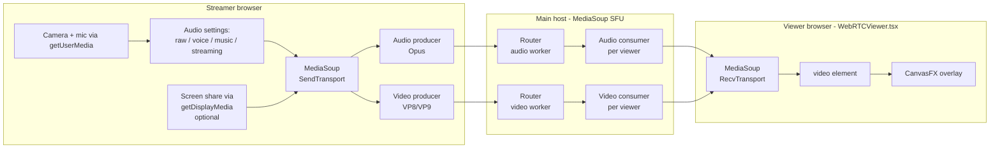
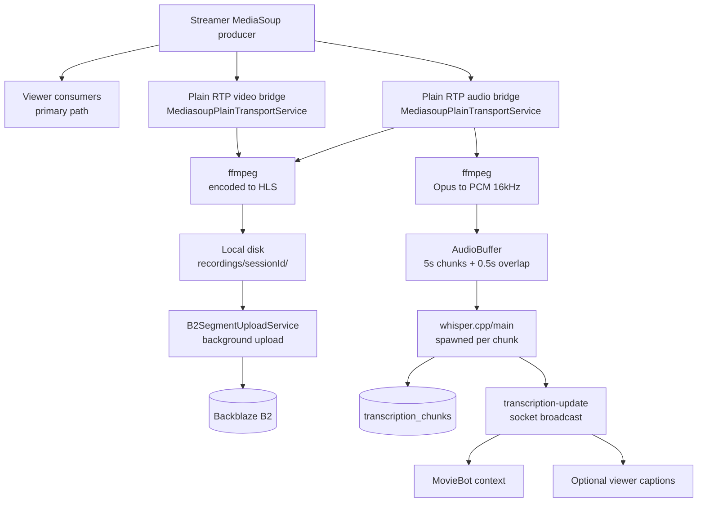
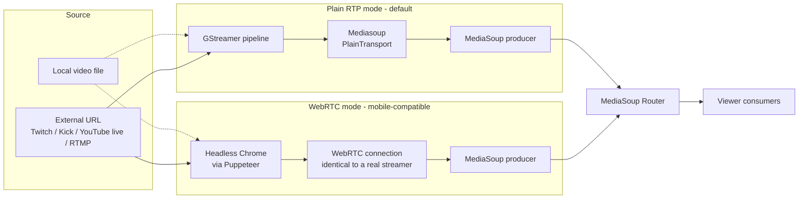

# Streaming stack

_Last verified: 2026-05-23 against commit 4a1d325._

How real-time A/V actually moves through OneStreamer: from a streamer's webcam, through MediaSoup, through optional secondary pipelines (recording, transcription, viewbots), to viewer browsers — and the limits of that architecture.

> [!WARNING]
> **Known A/V sync issue.** Audio and video travel over separate RTP streams (different UDP ports) and there is no RTCP sender-report synchronization between them. The result is a measured offset of roughly **333 ms** in production. The original `AV_SYNC_IMPLEMENTATION_COMPLETE.md` is misleading — the body admits the issue persists. See [`/docs/archive/av-sync/`](../archive/av-sync/). Fixing this would require either RTCP sender-report synchronization or muxed audio+video into a single transport — neither is implemented and neither is planned.

## The primary path (streamer → viewer)



The signaling for all of this (ICE candidates, transport params, producer/consumer creation) flows over Socket.IO on the main server (`:8443`), not over WebRTC itself. See [`realtime-events.md`](realtime-events.md) for the `mediasoup:*` event vocabulary.

### Why MediaSoup, not LiveKit

[ADR-0002](adr/0002-mediasoup-primary-livekit-dormant.md). Short version: MediaSoup is the primary; LiveKit infrastructure is dormant. A September 2025 dual-stack experiment was rolled back the same day after WebSocket-connectivity problems — see [ADR-0003](adr/0003-livekit-dual-stack-rollback.md).

### Why a SFU (not P2P, not MCU)

Selective Forwarding Unit: the server receives one stream from the streamer and forwards encrypted RTP packets to N viewers without decoding or re-encoding. Compared to P2P (multi-peer mesh) this scales to many viewers without exploding the streamer's upload bandwidth. Compared to MCU (decode + composite + re-encode) it has near-zero CPU per viewer and adds no latency from re-encoding.

The trade-off: the SFU can't transcode for different viewer bandwidths or merge multiple streams into one. Both are deliberate non-goals for OneStreamer.

## Branch pipelines (recording, transcription, viewbots)

Beyond the primary streamer → viewer flow, the streamer's audio + video also feed several secondary consumers:



Three independent secondary pipelines all tap the same `MediasoupPlainTransportService`:

- **Recording** — ffmpeg writes HLS segments to local disk; `B2SegmentUploadService` pushes them to B2 in the background. Chat messages are timestamped to the segment timeline by [`SessionChatCaptureService`](../../server/services/SessionChatCaptureService.js).
- **Transcription** — ffmpeg decodes Opus → PCM 16 kHz mono; the audio buffer chunks into 5-second windows with 500 ms overlap; whisper.cpp transcribes each chunk; text is persisted and broadcast.
- **Viewbots** (separate ingest path) — see below.

These pipelines don't share state with one another. If transcription is off, the recording still happens. If recording is off, transcription still happens. If both are off, the primary viewer path is unaffected.

## Viewbot ingest (the other direction)

Viewbots are "synthetic streamers" — local video files or external URLs piped into the platform as if they were a real streamer. The fleet has ~20 service variants ([`viewbot-fleet.md`](viewbot-fleet.md)) but one production orchestrator (`UnifiedViewBotRotation`) toggling between two modes:



**Plain RTP** is cheaper per bot (~5–10 % CPU, ~50 MB RAM) but doesn't support ICE/TURN, so mobile viewers behind CGNAT can't watch viewbot streams. **WebRTC mode** runs a headless Chrome via Puppeteer (so the bot looks identical to a real streamer to the SFU), at ~3–5× the cost.

The mode toggle is at runtime via `POST /api/viewbot-manager/toggle-mode`.

## Codec choices

| Track | Codec | Negotiation |
|-------|-------|-------------|
| Audio | **Opus** at 48 kHz stereo (or 16 kHz mono for Voice Chat preset). DTX disabled to avoid mid-stream audio dropouts. VAD disabled for the same reason. | Hard-coded in [`AudioOptimizationService`](../../server/services/AudioOptimizationService.js) and the MediaSoup router config |
| Video | **VP8** primary; **VP9** if both peers negotiate it | MediaSoup router config; browser SDP capability negotiation |
| Recording output | **H.264 / AAC in MPEG-TS HLS segments** | ffmpeg pipeline; not negotiated with browsers |
| Transcription input | **PCM 16 kHz mono** (decoded from Opus by ffmpeg) | Whisper requirement |

## Bandwidth and bitrate

MediaSoup transport options (in [`server/config/webrtc.config.js`](../../server/config/webrtc.config.js)):

```js
transportOptions: {
  enableUdp: true,
  enableTcp: true,         // TCP fallback for restrictive networks
  preferUdp: true,
  enableSctp: false,
  initialAvailableOutgoingBitrate: 300_000,    // 300 kbps initial
  minimumAvailableOutgoingBitrate: 100_000,    // 100 kbps floor
  maxIncomingBitrate: 1_500_000,               // 1.5 Mbps ceiling per incoming stream
}
```

The **VisualFX** subsystem can dynamically alter incoming bitrate on the producer side (`bitrate_potato`, `bitrate_low`, `bitrate_throttle` effects) — see [`/docs/features/visualfx-and-canvasfx.md`](../features/visualfx-and-canvasfx.md). When applied, the producer is reconfigured mid-stream.

## Port footprint

| Port | Protocol | What |
|------|----------|------|
| 80 | TCP | nginx HTTP → 301 redirect to HTTPS, plus ACME challenge |
| 443 | TCP | nginx HTTPS application traffic (proxies to :8443, :8444, :1337, :7882) |
| 8443 | TCP | Main server HTTPS (behind nginx) |
| 8444 | TCP | Chat-service HTTPS (behind nginx) |
| 3443 | TCP | React dev server (dev only; behind nginx in prod) |
| 1337 | TCP | Strapi CMS (localhost-only; nginx proxies `/strapi/*` and `/blog/*`) |
| 7882 | TCP | LiveKit signaling (localhost; dormant) |
| 7880 | TCP | LiveKit HTTP (dormant) |
| 11434 | TCP | Ollama (localhost) |
| **50000–50199** | **UDP** | **MediaSoup RTP — the only port range that needs to be reachable from the public internet for media** |
| 3478, 5349 | UDP/TCP | coturn TURN/STUN |

## NAT traversal

Two paths:

1. **Direct UDP** — streamer + viewer both have a routable path to the MediaSoup announced IP (<SERVER_IP> in production). The vast majority of WiFi viewers fall here.
2. **TURN relay** via coturn — for clients behind symmetric NAT, double-NAT, mobile 4G/5G CGNAT, or restrictive corporate firewalls. The browser hits coturn over UDP/3478 (or TCP/5349 if even UDP is blocked), coturn relays packets to MediaSoup.

The TURN credential pattern is HMAC-based with a shared secret (`TURN_SECRET`). Currently the same secret is hardcoded as a fallback in several server and client files — see the security note in [`/docs/operations/runbooks/secret-rotation.md`](../operations/runbooks/secret-rotation.md). The architecturally correct pattern is server-signed time-limited credentials per session; that hasn't been built yet.

## Limits and known gaps

| Item | Status | Workaround |
|------|--------|------------|
| A/V sync ~333 ms offset | Architectural; no fix planned | None — accept the offset |
| Single MediaSoup worker per router | By design (single-host) | Scale vertically; sharding would require new infra |
| LiveKit dual-stack | Rolled back ([ADR-0003](adr/0003-livekit-dual-stack-rollback.md)) | LiveKit infra remains for future revival |
| HLS fallback path | Implemented but not the primary | Default is WebRTC; HLS is only when WebRTC fails to negotiate |
| Mobile mediasoup-client + 4G/5G | Mostly works via TURN; some carriers block UDP entirely | Browser may auto-fall back to HLS; viewbots can be flipped to WebRTC mode |
| Recording → B2 upload back-pressure | Local files accumulate if B2 upload fails | Monitor `recordings/active/` size; see [`/docs/operations/runbooks/recording-upload-failed.md`](../operations/runbooks/recording-upload-failed.md) |
| Several `STREAM_RELIABILITY_PLAN` items pending (transport race, `stream-ready` dedup) | See [`/docs/archive/plans/STREAM_RELIABILITY_PLAN.md`](../archive/plans/STREAM_RELIABILITY_PLAN.md) | Admin disconnect + retry is the current workaround |

## Code paths

| Concern | File |
|---------|------|
| MediaSoup router/transport setup | [`server/services/MediasoupService.js`](../../server/services/MediasoupService.js) |
| Plain RTP bridge for recording / transcription / viewbots | [`server/services/MediasoupPlainTransportService.js`](../../server/services/MediasoupPlainTransportService.js) |
| WebRTC adapter (LiveKit/MediaSoup abstraction) | [`server/services/WebRTCAdapter.js`](../../server/services/WebRTCAdapter.js), [`WebRTCAdapterV2.js`](../../server/services/WebRTCAdapterV2.js) |
| Streamer state | [`server/services/StreamService.js`](../../server/services/StreamService.js) |
| Takeover handshake | [`server/services/TakeoverService.js`](../../server/services/TakeoverService.js) |
| Recording orchestration | [`server/services/ContinuousRecordingService.js`](../../server/services/ContinuousRecordingService.js) |
| B2 segment upload | [`server/services/B2SegmentUploadService.js`](../../server/services/B2SegmentUploadService.js) |
| Transcription | [`server/services/TranscriptionService.js`](../../server/services/TranscriptionService.js) |
| Audio codec config | [`server/services/AudioOptimizationService.js`](../../server/services/AudioOptimizationService.js) |
| MediaSoup configuration | [`server/config/webrtc.config.js`](../../server/config/webrtc.config.js) |
| Viewer client | [`client/src/components/stream/WebRTCViewer.tsx`](../../client/src/components/stream/WebRTCViewer.tsx) |
| Streamer client | [`client/src/components/stream/WebRTCStreamer.tsx`](../../client/src/components/stream/WebRTCStreamer.tsx) |
| Mediasoup client wrapper | [`client/src/services/MediasoupClient.ts`](../../client/src/services/MediasoupClient.ts) |

## See also

- [`overview.md`](overview.md) — the layered system view
- [`viewbot-fleet.md`](viewbot-fleet.md) — synthetic ingest in detail
- [`/docs/features/streaming-and-takeover.md`](../features/streaming-and-takeover.md) — user-facing flow
- [`/docs/features/recording-and-clips.md`](../features/recording-and-clips.md) — what happens to recorded segments
- [`/docs/features/transcription.md`](../features/transcription.md) — Whisper pipeline detail
- [ADR-0002](adr/0002-mediasoup-primary-livekit-dormant.md), [ADR-0003](adr/0003-livekit-dual-stack-rollback.md)
