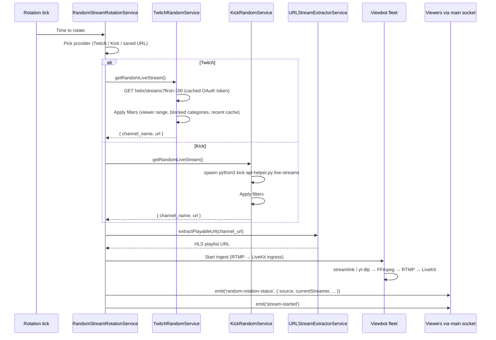

# External stream sources (Twitch & Kick rotation)

_Last verified: 2026-05-23 against commit 4a1d325._

When no real streamer is broadcasting, OneStreamer can auto-rotate through random live streams from Twitch and Kick. This keeps the platform "alive" between human-streamer sessions. Rotation is driven by an orchestrator that picks the next source, hands it to the viewbot fleet to ingest, and broadcasts it as if it were a regular stream.

## What users see

- The stream banner shows "Random rotation" (or similar) with the current source label (e.g. `Twitch: cohh`)
- Standard viewer controls still work — chat, items, buffs, effects all apply to the rotating stream
- Chat commands let viewers influence the rotation:
  - `!skip` / `!next` → vote to rotate immediately
  - `!swap <url>` → vote to replace with a specific URL
  - `!extend` / `!reduce` → vote to lengthen / shorten the current slot
  - `!lock` / `!unlock` → vote to pause / resume automatic rotation
  - See [`voting-and-claims.md`](voting-and-claims.md) for the vote thresholds and windows

When a human streamer takes over via the usual `request-to-stream` flow, rotation pauses; when they stop, rotation resumes after the global cooldown.

## Source providers

| Source | Mechanism | Credentials needed |
|--------|-----------|--------------------|
| **Twitch** | Helix API via OAuth 2.0 client credentials | `TWITCH_CLIENT_ID` + `TWITCH_CLIENT_SECRET` — see [`/docs/integrations/twitch.md`](../integrations/twitch.md) |
| **Kick** | Public-page scrape via `curl_cffi` Python helper | None (public scrape; depends on `curl_cffi` Python package) — see [`/docs/integrations/kick.md`](../integrations/kick.md) |
| **Arbitrary URL** | Direct user input via `POST /api/url-stream` or the `!swap <url>` chat command | None — accepts any public HTTP / RTMP / HLS / YouTube-live URL |

## Filters

The rotation picks live streams from the source pool but applies filters to avoid surfacing mega-streamers or off-topic content:

- **Viewer-count range**: 1–5,000 (configurable)
- **Blocked categories**: includes `ASMR`, `Pools, Hot Tubs, and Beaches` by default. Extend the list in [`TwitchRandomService.js`](../../server/services/TwitchRandomService.js) / [`KickRandomService.js`](../../server/services/KickRandomService.js).
- **Recent-cache**: skips the last ~50 channels seen so repeats are rare (cache is in-memory; lost on server restart)

## How it works under the hood



## Configuration

Env vars that affect rotation:

| Variable | Default | Purpose |
|----------|---------|---------|
| `VIEWBOT_MIN_INTERVAL` | (in code) | Min ms between rotations |
| `VIEWBOT_MAX_INTERVAL` | (in code) | Max ms between rotations |
| `VIEWBOT_ROTATION_ENABLED` | (in code) | Master switch |
| `TWITCH_CLIENT_ID` / `TWITCH_CLIENT_SECRET` | (none) | Twitch API auth |

Vote thresholds for rotation control live in [`chat-service/index.js`](../../chat-service/index.js) — see [`voting-and-claims.md`](voting-and-claims.md).

## Admin controls

```bash
# Status
curl -s -H "x-admin-key: $ADMIN_KEY" \
  https://onestreamer.live/api/random-stream/status | jq

# Start rotation
curl -X POST -H "x-admin-key: $ADMIN_KEY" \
  https://onestreamer.live/api/random-stream/start

# Force rotate now
curl -X POST -H "x-admin-key: $ADMIN_KEY" \
  https://onestreamer.live/api/random-stream/rotate

# Stop rotation
curl -X POST -H "x-admin-key: $ADMIN_KEY" \
  https://onestreamer.live/api/random-stream/stop
```

Admin panel → URL Streams tab includes preset management (save common URLs for one-click activation).

## What can go wrong

| Symptom | Cause | Where to look |
|---------|-------|---------------|
| Rotation never advances | Bot orchestrator stuck or provider returning empty results | [`/docs/operations/runbooks/viewbot-fleet-misbehaving.md`](../operations/runbooks/viewbot-fleet-misbehaving.md) |
| Rotation lands on inappropriate content | Category filter missed it | Extend blocked-category list in the source service |
| Same streamer keeps repeating | Recent-cache too small or server restarted | In-memory cache — accept some repeats around restarts |
| Twitch source breaks | Credentials wrong or revoked | [`/docs/integrations/twitch.md`](../integrations/twitch.md) → Troubleshooting |
| Kick source breaks | `curl_cffi` missing or Kick changed page structure | [`/docs/integrations/kick.md`](../integrations/kick.md) → Troubleshooting |
| Rotation broadcasts a black frame | Source stream went offline mid-slot; bot didn't detect EOF | Force a rotate manually; investigate the bot pipeline |

## Code paths

| Concern | File |
|---------|------|
| Top-level rotation orchestrator | [`server/services/RandomStreamRotationService.js`](../../server/services/RandomStreamRotationService.js) |
| Twitch source | [`server/services/TwitchRandomService.js`](../../server/services/TwitchRandomService.js) |
| Kick source | [`server/services/KickRandomService.js`](../../server/services/KickRandomService.js) + [`kick-api-helper.py`](../../server/services/kick-api-helper.py) |
| URL extraction | [`server/services/URLStreamExtractorService.js`](../../server/services/URLStreamExtractorService.js) |
| Viewbot ingest | [`server/services/ViewBotURLService.js`](../../server/services/ViewBotURLService.js) + [`ViewBotLiveKitService.js`](../../server/services/ViewBotLiveKitService.js) |
| HTTP routes | [`server/routes/random-stream.js`](../../server/routes/random-stream.js) |
| Chat-vote callbacks | [`chat-service/index.js`](../../chat-service/index.js) |

## See also

- [`/docs/architecture/viewbot-fleet.md`](../architecture/viewbot-fleet.md) — how external streams become viewbot streams
- [`/docs/integrations/twitch.md`](../integrations/twitch.md), [`/docs/integrations/kick.md`](../integrations/kick.md) — per-source detail
- [`voting-and-claims.md`](voting-and-claims.md) — chat commands that influence rotation
- [`/docs/operations/runbooks/viewbot-fleet-misbehaving.md`](../operations/runbooks/viewbot-fleet-misbehaving.md) — when rotation breaks
