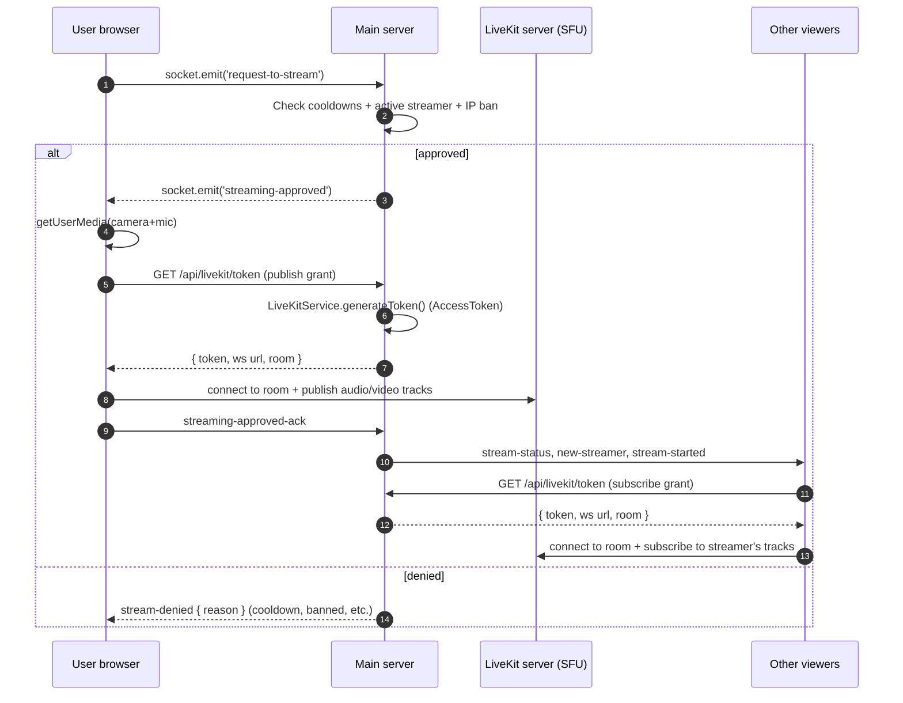

# Streaming and takeover

_Last verified: 2026-06-01 against `main` (post-ADR-0024 LiveKit-only cleanup)._

OneStreamer is built around a **single-streamer model**: only one person broadcasts at a time. Viewers can request to take over the stream with the click of a button, subject to dual cooldowns (global + per-user). This page covers the streaming flow, the takeover handshake, the cooldown mechanics, audio configuration, and known issues.

> [!WARNING]
> **Partial reliability remediation.** The `currentStreamer` dual-source-of-truth bug between `StreamService` and the WebRTC service (now `LiveKitService`) was fixed. The remaining items in the Nov-2025 stream-reliability plan (`stream-ready` event de-duplication, takeover race-window hardening) are not all implemented — see [`/docs/archive/plans/STREAM_RELIABILITY_PLAN.md`](../archive/plans/STREAM_RELIABILITY_PLAN.md). The plan predates the MediaSoup retirement ([ADR-0024](../architecture/adr/0024-retire-mediasoup-livekit-only.md)); its MediaSoup transport-recreation items no longer apply.

## How streaming works

Real-time media flows over WebRTC through **LiveKit**, which is the Selective Forwarding Unit (SFU) — it is the sole WebRTC backend ([ADR-0024](../architecture/adr/0024-retire-mediasoup-livekit-only.md)). The streamer's browser **publishes** audio/video tracks to a LiveKit room; viewer browsers **subscribe** to those tracks. The LiveKit server forwards the media per-subscriber; the OneStreamer main server does **not** forward RTP itself — it mints LiveKit access tokens and coordinates the handshake over Socket.IO. See [`/docs/architecture/streaming-stack.md`](../architecture/streaming-stack.md) for the full topology.

### Becoming the streamer



### Taking over an active stream

Same flow as above, but if there's already an active streamer:

1. The taker's `request-to-stream` triggers a takeover evaluation in [`TakeoverService`](../../server/services/TakeoverService.js).
2. If approved, the *previous* streamer receives `stream-ended` with `reason: 'takeover'` and unpublishes their LiveKit tracks (their client disconnects from the room).
3. The previous streamer also receives an individual cooldown — they can't immediately take it back.
4. All viewers receive `stream-switching` then `stream-started` with the new streamer.

### Stopping a stream

Either the streamer clicks Stop (`socket.emit('stop-streaming')`) or an admin disconnects them (`POST /api/admin/stream/disconnect`). In both cases, viewers receive `stream-ended` with a reason and the global cooldown starts.

## Cooldowns

Two layered cooldowns prevent stream-thrashing:

| Cooldown | When it starts | Default | Configurable via |
|----------|----------------|--------:|------------------|
| **Global** | After any stream change | 30 s (prod), 1 s (dev) | `GLOBAL_COOLDOWN_SECONDS` env var |
| **Individual** | When a specific user gets taken over | 60 s (prod), 1 s (dev) | `INDIVIDUAL_COOLDOWN_SECONDS` env var |

Both cooldowns are tracked server-side and broadcast to clients via `cooldown-status-update` so the takeover button reflects accurate state.

Cooldowns can be moved by **guard** and **weapon** items in the inventory system — see [`items-and-buffs.md`](items-and-buffs.md). Admin disconnects do **not** trigger a global cooldown (clean disconnect).

## Anyone can stream — anonymously?

Not anymore. The original MVP allowed anonymous streaming. The current production setup requires an authenticated account (email/password or Google OAuth), with an email-verified account for some advanced actions. See [`/docs/security/auth-flows.md`](../security/auth-flows.md) and [`/docs/integrations/google-oauth.md`](../integrations/google-oauth.md).

## Audio settings (streamer-side)

Streamers can configure how the browser captures and encodes audio before it is published to the LiveKit room. The control surface is the **🎵 Audio Settings** panel in the streaming UI ([`AudioSettings.tsx`](../../client/src/components/audio/AudioSettings.tsx)).

### Presets

| Preset | Echo cancel | Noise suppress | Auto gain | Sample rate | Channels | Use case |
|--------|:-----------:|:--------------:|:---------:|------------:|:--------:|----------|
| **Raw Audio** (default) | off | off | off | 48 kHz | stereo | Music, instrument testing, anything where unprocessed audio matters |
| **Voice Chat** | on | on | on | 16 kHz | mono | Speaking; lower bandwidth |
| **Music** | off | off | off | 48 kHz | stereo | High-fidelity music; same as Raw but explicitly framed |
| **Streaming** | on | on | off | 48 kHz | stereo | General use; balanced |

### Individual controls

Fine-tune each parameter independently:

- **Echo cancellation** — removes feedback when speakers are audible to the mic
- **Noise suppression** — reduces steady background noise
- **Auto gain control** — automatically normalizes loud/quiet input
- **Sample rate** — 16, 24, 44.1, or 48 kHz
- **Channels** — mono (1) or stereo (2)

Voice Activity Detection (VAD) is always **disabled** to avoid mid-stream audio cutoff. Discontinuous Transmission (DTX) is also disabled at the server-side Opus codec config.

### Persistence and timing

- Settings persist per-browser via `localStorage` (cookie-backed via `CookieService`).
- Changes made **before** starting a stream apply immediately when the stream starts.
- Changes made **during** a live stream apply on the **next** stream (the panel shows a warning to that effect). Users must Stop and re-Start to apply mid-stream changes.

### Chrome-specific flags

When the browser exposes the legacy `goog*` constraints, they're set in sync with the user's choices:

- `googEchoCancellation`
- `googNoiseSuppression`
- `googAutoGainControl`
- `googNoiseReduction`

### Default config (Raw Audio)

```js
{
  echoCancellation: false,
  noiseSuppression: false,
  autoGainControl: false,
  sampleRate: 48000,
  channelCount: 2,
  profile: 'raw',
}
```

### Audio troubleshooting

| Symptom | Try |
|---------|-----|
| Audio cuts in and out | Switch to **Raw Audio** preset; clear browser cache; check Windows audio enhancements aren't aggressively processing mic input |
| Echo / feedback | Enable Echo Cancellation; use headphones; move the mic away from speakers |
| Background noise | Enable Noise Suppression or switch to **Streaming** / **Voice Chat** preset |
| Volume too low or too high | Toggle Auto Gain Control; adjust mic gain in the OS audio settings |

## Streamer-side video controls

Beyond audio, the streamer can configure:

- **Camera / mic selection** — choose between connected devices
- **Resolution and frame rate** — typically 720p/30fps or 1080p/30fps
- **Screen share** — replace camera with `getDisplayMedia()` capture
- **Mirror preview** — flips local preview only (viewers see normal-orientation)

All in [`StreamerSettings.tsx`](../../client/src/components/stream/StreamerSettings.tsx) (~1.4k LOC — the largest "settings" component in the app).

## Viewer-side rendering

Viewers receive media via [`WebRTCViewer.tsx`](../../client/src/components/stream/WebRTCViewer.tsx) (the largest single React component at ~2.7k LOC). It:

- Subscribes to the active streamer's published LiveKit tracks (via [`LiveKitClient.ts`](../../client/src/services/LiveKitClient.ts)) and attaches them to the `<video>` element. There is **no HLS fallback for live viewing** — that path went away with MediaSoup ([ADR-0024](../architecture/adr/0024-retire-mediasoup-livekit-only.md)). (`hls.js` survives in the client only for admin VOD/recording playback, not live streams.)
- Renders an audio-level meter ([`AudioLevelMeter.tsx`](../../client/src/components/audio/AudioLevelMeter.tsx)) when locally enabled
- Surfaces the takeover button + cooldown countdown via [`StreamControls.tsx`](../../client/src/components/stream/StreamControls.tsx)

## Stats and observability

Every stream is recorded — see [`recording-and-clips.md`](recording-and-clips.md). For live diagnostics:

- `GET /health` — basic server liveness
- `GET /api/stream/status` — current streamer, viewer count, stream duration
- Admin panel → Dashboard tab → real-time viewer count, bitrate, codec
- Admin panel → Connections tab → per-socket detail (IP, user-agent, rooms)

## Server-side processes that affect streaming

| Service | Role |
|---------|------|
| [`StreamService`](../../server/services/StreamService.js) | Source of truth for current streamer + viewer list |
| [`TakeoverService`](../../server/services/TakeoverService.js) | Takeover request/approve/deny + cooldown enforcement |
| [`LiveKitService`](../../server/services/LiveKitService.js) | Mints LiveKit access tokens, owns the room lifecycle, emits `stream-ended`. The SFU itself is the **LiveKit server**, not this process — see [`streaming-stack.md`](../architecture/streaming-stack.md). Client side: streamer publishes via [`WebRTCStreamer.tsx`](../../client/src/components/stream/WebRTCStreamer.tsx) → [`LiveKitClient.ts`](../../client/src/services/LiveKitClient.ts); viewers subscribe via the same `LiveKitClient.ts`. |
| [`SessionService`](../../server/services/SessionService.js) | IP → user mapping; survives socket reconnect |
| [`IPBanService`](../../server/services/IPBanService.js) | Pre-stream gate — banned IPs can't `request-to-stream` |
| [`ContinuousRecordingService`](../../server/services/ContinuousRecordingService.js) | Records every stream as it goes (see [`recording-and-clips.md`](recording-and-clips.md)) |
| [`AudioOptimizationService`](../../server/services/AudioOptimizationService.js) | Negotiates Opus codec params; reports audio quality |

## See also

- [`/docs/architecture/streaming-stack.md`](../architecture/streaming-stack.md) — full media pipeline topology
- [`/docs/architecture/realtime-events.md`](../architecture/realtime-events.md) — the full socket-event vocabulary
- [`/docs/operations/runbooks/stream-stuck.md`](../operations/runbooks/stream-stuck.md) — what to do when a stream wedges
- [`items-and-buffs.md`](items-and-buffs.md) — guard/weapon items that modify takeover cooldowns
- [`chat-and-moderation.md`](chat-and-moderation.md) — admin tools for ending streams
- [`recording-and-clips.md`](recording-and-clips.md) — what gets recorded and where it ends up
