# Deployment

_Last verified: 2026-05-23 against commit 4a1d325._

The current production topology of OneStreamer at [onestreamer.live](https://onestreamer.live). This document describes what's running on what host, how processes are managed, how requests flow through nginx, and how TLS is handled.

## Topology

```mermaid
flowchart TB
    subgraph Internet
        Users[End users<br/>browsers]
    end

    subgraph Host[Single production host - <SERVER_IP>]
        subgraph Edge["Edge layer"]
            Nginx[nginx<br/>:80 :443<br/>TLS terminator + reverse proxy]
            LE[Let's Encrypt<br/>certbot]
        end

        subgraph App["Application processes - PM2"]
            Main[onestreamer-server<br/>:8443 HTTPS<br/>main API + signaling]
            Chat[onestreamer-chat<br/>:8444 HTTPS<br/>chat microservice]
            Client[onestreamer-client<br/>:3443 HTTPS<br/>CRA dev server]
        end

        subgraph Companions["Companion services - systemd"]
            Strapi[Strapi CMS<br/>:1337<br/>blog content]
            LiveKit[LiveKit server<br/>:7880 :7882<br/>dormant]
            Coturn[coturn<br/>:3478 :5349<br/>TURN/STUN]
            Ollama[Ollama<br/>:11434<br/>local LLM]
        end

        subgraph Realtime["Real-time media"]
            Mediasoup[MediaSoup<br/>UDP 50000-50199<br/>WebRTC SFU]
        end

        subgraph Persist["Persistence"]
            SQLite[(SQLite<br/>server/data/onestreamer.db)]
            LocalFS[(Local filesystem<br/>recordings/ clips/<br/>audio-buffers/)]
            WhisperModels[(whisper.cpp<br/>+ models/)]
        end
    end

    subgraph External["External services"]
        B2[(Backblaze B2)]
        SendGrid[SendGrid SMTP]
        GoogleAuth[Google OAuth]
        Turnstile[Cloudflare Turnstile]
        TwitchAPI[Twitch Helix API]
        KickPublic[Kick public scrape]
        GroqAPI[Groq API<br/>optional]
        Soundboards[101soundboards API]
    end

    Users -->|HTTPS 443| Nginx
    Users <==>|WebRTC UDP 50000-50199| Mediasoup
    Users -.->|TURN UDP 3478| Coturn
    LE -->|certs| Nginx
    Nginx --> Main
    Nginx --> Chat
    Nginx --> Client
    Nginx --> Strapi
    Nginx --> LiveKit
    Main --> Mediasoup
    Main --> SQLite
    Main --> LocalFS
    Main --> WhisperModels
    Main --> Ollama
    Chat --> Main
    Strapi --> Main
    Main -.->|recording uploads| B2
    Main -.->|verification emails| SendGrid
    Main -.->|OAuth flow| GoogleAuth
    Main -.->|CAPTCHA verify| Turnstile
    Main -.->|random rotation| TwitchAPI
    Main -.->|random rotation| KickPublic
    Main -.->|LLM fallback| GroqAPI
    Main -.->|sound URLs| Soundboards
```



## Single-host design

OneStreamer runs entirely on **one host**. There is no horizontal scaling, no load balancer in front of multiple app servers, no distributed cache. The architecture is deliberately single-host:

- MediaSoup workers are local to the process — no router sharding.
- SQLite is the database — one file, one writer.
- Chat-service in-memory state isn't shared with anyone (because there's no second chat-service instance).
- Sticky-session requirements vanish because there's only one server.

The host runs on a public IP (`<SERVER_IP>`) that's also the MediaSoup announced IP. WebRTC clients need a clear UDP path to that IP in the 50000–50199 range.

## Process management — PM2

All three Node applications are managed by [PM2](https://pm2.keymetrics.io/) via [`ecosystem.config.js`](../../ecosystem.config.js):

```js
apps: [
  { name: 'onestreamer-server', script: './server/index.js', max_memory_restart: '2G', /* env */ },
  { name: 'onestreamer-chat',   script: './chat-service/index.js', max_memory_restart: '1G', /* env */ },
  { name: 'onestreamer-client', script: 'npm', args: 'start', cwd: './client', max_memory_restart: '2G', /* env */ },
]
```

| Process | Role | Memory cap |
|---------|------|------------|
| `onestreamer-server` | Main API + signaling | 2 GB |
| `onestreamer-chat` | Chat microservice | 1 GB |
| `onestreamer-client` | React dev server (notable: prod runs CRA dev server, not a static build) | 2 GB |

Standard PM2 operations:

```bash
pm2 start ecosystem.config.js     # start all
pm2 restart all                   # restart all (preserves env)
pm2 restart onestreamer-server    # restart just one
pm2 logs                          # tail all
pm2 logs onestreamer-server       # tail one
pm2 env onestreamer-server        # show actual env loaded by a process
pm2 stop all                      # stop without removing
pm2 delete all                    # remove from PM2
pm2 save                          # persist current process list across reboots
pm2 startup                       # generate the systemd unit that boots PM2 on system start
```

The companion services (Strapi, LiveKit, coturn, Ollama) are managed by **systemd** outside PM2.

For deploys and recovery (kill stale processes, regenerate dev certs if missing, check nginx config, start PM2, sanity-check ports), use [`scripts/deploy/start-production.sh`](../../scripts/deploy/start-production.sh).

## nginx — TLS termination + reverse proxy

Production config path: `/etc/nginx/sites-available/onestreamer.live`. The repo ships a sanitized reference at **[`nginx/onestreamer.example.conf`](../../nginx/onestreamer.example.conf)** — replace `YOUR_DOMAIN` and drop into `/etc/nginx/sites-available/`. Per-deploy server-block files are gitignored (`nginx/*` with `!nginx/*.example.conf`).

### Upstream definitions

```nginx
upstream main_backend  { server 127.0.0.1:8443; keepalive 32; }
upstream chat_backend  { server 127.0.0.1:8444; keepalive 16; }
```

### Routing summary

| Path pattern | Routes to |
|--------------|-----------|
| `/auth/success`, `/auth/error` | Static `/var/www/html` → falls back to `index.html` (React SPA) |
| `/auth/*` (else) | `main_backend` |
| `/api/*` | `main_backend` |
| `/socket.io/` (regex) | `main_backend` (WebSocket upgrade, 1-hour timeouts) |
| `/chat/socket.io/` (`^~` priority) | `chat_backend` (WebSocket upgrade, 1-hour timeouts) |
| `/uploads/avatars/*` | Direct file serve from `/var/www/uploads/avatars/`, 30-day cache |
| `/uploads/*` (else) | `main_backend` |
| `/admin/*` | `main_backend` (with `x-admin-key` + `Authorization` headers passed through, 100 MB body limit) |
| `/health` | `main_backend` |
| `*.{js,css,png,jpg,svg,woff,...}` (regex) | Static `/var/www/html`, no-cache headers (for SPA freshness) |
| `/favicon.ico`, `/manifest.json` | Static `/var/www/html` |
| `/livekit/rtc`, `/livekit/twirp/`, `/livekit` | `127.0.0.1:7882` (LiveKit WebSocket, 7-day timeouts) |
| `/clips/{uuid}` | `main_backend` (server-side rendering for OG meta tags on clip share links) |
| `/blog/{slug}` | `main_backend` (SSR for OG meta — fetches from Strapi) |
| `/blog/assets/*` | Static `/var/www/html/blog/assets/`, 30-day cache |
| `/blog`, `/blog/`, `/blog/index.html` | Static `/var/www/html/blog/index.html`, no-cache |
| `/strapi/*` (`^~` priority) | `127.0.0.1:1337` (rewrites `/strapi/foo` → `/foo`; for admin + API) |
| `/` (catch-all) | Static `/var/www/html/index.html` (SPA) with no-cache headers |

Live config (read with sudo):

```bash
sudo cat /etc/nginx/sites-available/onestreamer.live
sudo nginx -t                       # validate config without reload
sudo nginx -s reload                # apply config changes
sudo systemctl status nginx
```

### Security headers

```nginx
add_header X-Frame-Options          "SAMEORIGIN"           always;
add_header X-Content-Type-Options   "nosniff"              always;
add_header X-XSS-Protection         "1; mode=block"        always;
add_header Strict-Transport-Security "max-age=31536000; includeSubDomains" always;
```

### Body limits + timeouts

- `client_max_body_size 5G` (for file uploads)
- `client_body_timeout 300s`
- `proxy_buffer_size 128k`, `proxy_buffers 4 256k`, `proxy_busy_buffers_size 256k` (for large headers / JWTs)
- WebSocket proxy timeouts: 1 hour for application sockets, 7 days for LiveKit RTC

## TLS — Let's Encrypt via certbot

Certificates at:

```
/etc/letsencrypt/live/onestreamer.live/
├── fullchain.pem        (cert + intermediate)
├── privkey.pem          (private key)
└── (symlinks to archive/)
```

Same cert covers `onestreamer.live`, `www.onestreamer.live`, `livekit.onestreamer.live` (verify with `sudo certbot certificates`).

Renewal:

```bash
sudo certbot renew --dry-run        # check renewal works
sudo certbot renew                  # actually renew (idempotent)
sudo systemctl status certbot.timer # automated renewal timer status
```

The ACME challenge path (`/.well-known/acme-challenge/`) is served from `/var/www/html` on port 80 — confirmed in the nginx config.

## React build vs dev server in production

A notable quirk: production currently runs the **CRA dev server** (`npm start` from the client/ directory) rather than a static `npm run build` output served by nginx. The reasons aren't fully documented; likely historical convenience. Implications:

- Higher memory + CPU than a static build would require.
- Hot-reload code exists in production (no observed exploit vector, but unnecessary).
- nginx still serves `/var/www/html` for some static paths (per the routes above) — this is the build artifact when one exists, but the live SPA may be the dev-server output served via the catch-all proxy.

A cleanup PR would `npm run build` once, copy `client/build/*` to `/var/www/html/`, and remove `onestreamer-client` from PM2. Captured as a follow-up; not in scope of the docs overhaul.

## Companion services

### Strapi CMS (`:1337`)

Lives at `/root/strapi-blog/backend`. Managed as its own process (likely systemd; not in `ecosystem.config.js`). nginx routes `/strapi/*` to it for admin + API. The main server fetches article content for the `/blog/{slug}` SSR path. See [`/docs/integrations/strapi.md`](../integrations/strapi.md).

### LiveKit (`:7880`, `:7882`)

Running but dormant — see [ADR-0002](../architecture/adr/0002-mediasoup-primary-livekit-dormant.md). nginx exposes it via the `livekit.onestreamer.live` subdomain and the `/livekit/*` paths.

### coturn

System service; UDP `:3478` (STUN/TURN) and TCP `:5349` (TURN-over-TLS). Config at `/etc/turnserver.conf`. Shares the `TURN_SECRET` HMAC with the main server.

### Ollama (`:11434`)

System service. Loaded models live in `~/.ollama/models/`. Default: `mistral`.

## Filesystem layout

```
/root/onestreamer/                  application root
├── server/                         main server source
├── chat-service/                   chat service source
├── client/                         React app source
│   └── build/                      static build (may or may not be live-served)
├── docs/                           this documentation tree
├── ecosystem.config.js             PM2 config
├── scripts/                        setup, ops, deploy, and migration helpers
├── recordings/                     local recording segments (gitignored)
│   ├── active/   processing/   completed/   archived/
│   ├── thumbnails/   metadata/   temp/   backups/
├── clips/                          extracted clips (gitignored)
│   ├── videos/   thumbnails/   temp/
├── egress-recordings/              LiveKit egress output (gitignored)
├── audio-buffers/                  transcription audio scratch (gitignored)
├── whisper/                        Whisper binary + models (whisper.cpp/main is the live binary)
│   ├── models/*.bin               (gitignored; large)
│   └── whisper.cpp/
├── certificates/                   TLS certs for dev / non-letsencrypt
├── logs/                           PM2 logs
├── blog/                           Strapi blog static assets
├── public/                         server-served static files (HLS, etc.)
└── server/data/onestreamer.db      SQLite database
```

## Environment loading

PM2 reads env vars from `ecosystem.config.js`'s per-app `env:` block. **`ecosystem.config.js` is tracked in git**, so put only non-secret config there; pull real secrets from `.env`.

The processes also load `.env` via dotenv at the top of `server/index.js` and `chat-service/index.js`. Precedence (highest first): real shell env > `ecosystem.config.js` `env:` block > `.env`.

After editing `.env`, restart with `pm2 restart all --update-env` to pick up changes. Plain `pm2 restart all` keeps the previously loaded env.

## Deployment workflow (manual)

There is no CI/CD pipeline today; deploys are manual:

```bash
cd /root/onestreamer
git fetch && git pull origin main
npm install                          # if root deps changed
cd client && npm install && cd ..    # if client deps changed
cd chat-service && npm install && cd ..  # if chat deps changed
# Run any pending migrations
node server/migrations/<new-migration>.js
# Restart
pm2 restart all --update-env
pm2 logs                             # watch for boot errors
```

For database schema changes: back up first.

```bash
cp server/data/onestreamer.db server/data/onestreamer.db.backup-$(date +%F-%H%M)
```

See [`backup-restore.md`](backup-restore.md) for the full backup procedure.

## Observability

| Source | Where |
|--------|-------|
| App logs | `pm2 logs` or `/root/onestreamer/logs/*.log` |
| nginx access log | `/var/log/nginx/access.log` |
| nginx error log | `/var/log/nginx/error.log` |
| coturn log | `/var/log/turnserver/turnserver.log` |
| systemd journals | `journalctl -u <unit>` (Strapi, LiveKit, Ollama, certbot.timer) |
| Health probes | `GET /health` on `:8443` and `:8444` |
| Resource usage | `pm2 monit`, system `htop`, `iotop`, B2 dashboard |

See [`monitoring.md`](monitoring.md) for the per-symptom diagnosis paths.

## Disaster recovery

1. **SQLite is corrupt** → restore from latest backup (see [`backup-restore.md`](backup-restore.md)). All point balances + items + recordings metadata come back; in-flight chat is lost.
2. **Recordings disk full** → check `B2SegmentUploadService` is uploading; if uploads are stuck, recordings accumulate. [`recording-upload-failed.md`](runbooks/recording-upload-failed.md).
3. **MediaSoup processes crash** → `pm2 restart onestreamer-server`. Active streams drop; users have to refresh.
4. **Whole host down** → unrelated to OneStreamer; standard host-failure procedure. No HA today.

## See also

- [`backup-restore.md`](backup-restore.md) — backup procedure
- [`monitoring.md`](monitoring.md) — what to watch and what it means
- [`upgrades.md`](upgrades.md) — version-to-version migration notes
- [`runbooks/`](runbooks/) — incident-class procedures
- [`/docs/architecture/overview.md`](../architecture/overview.md) — system architecture (the why)
- [`/docs/getting-started/environment-variables.md`](../getting-started/environment-variables.md) — full env-var reference
