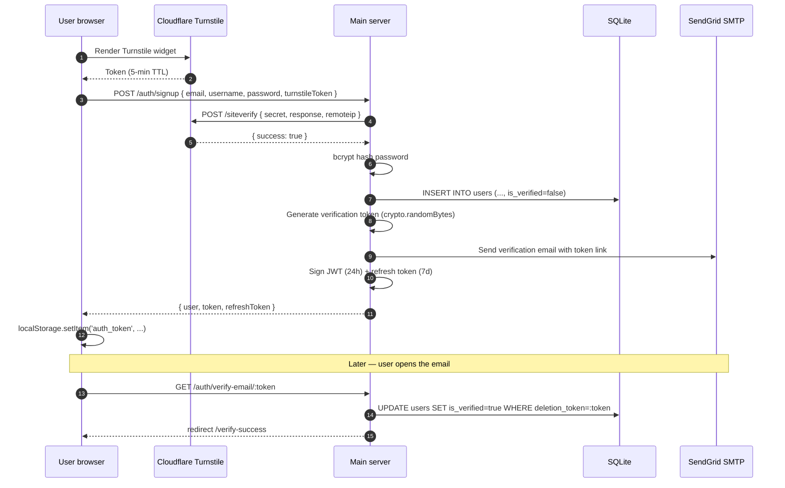
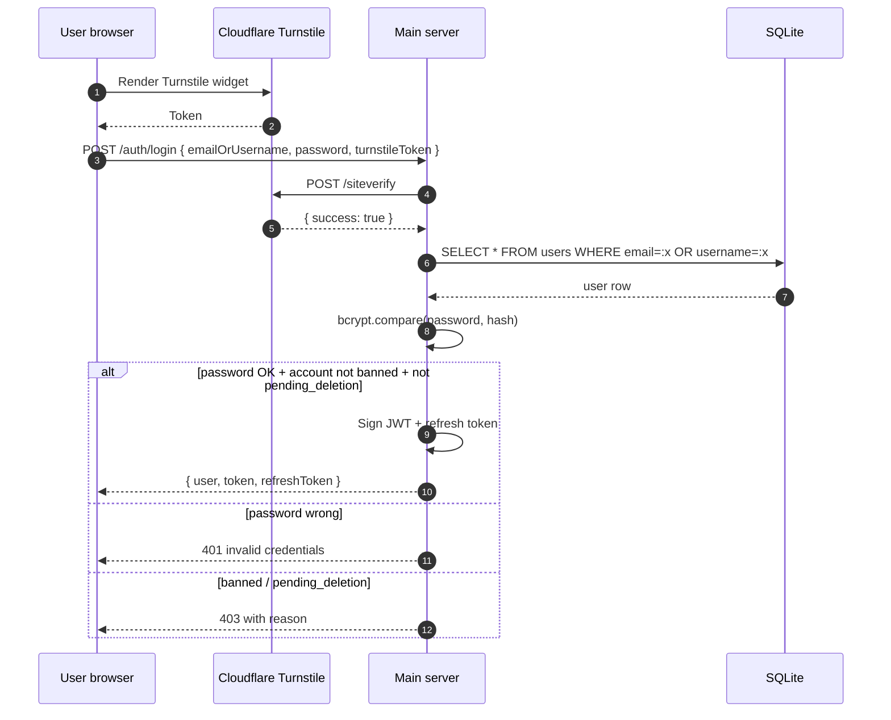
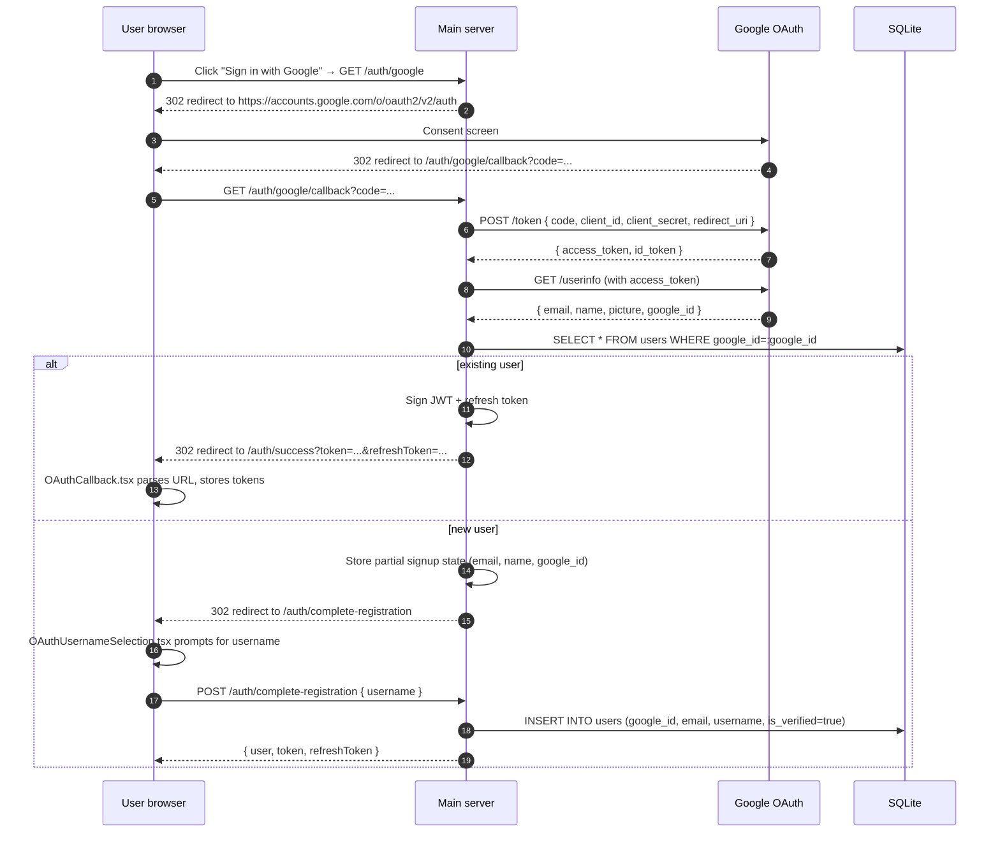
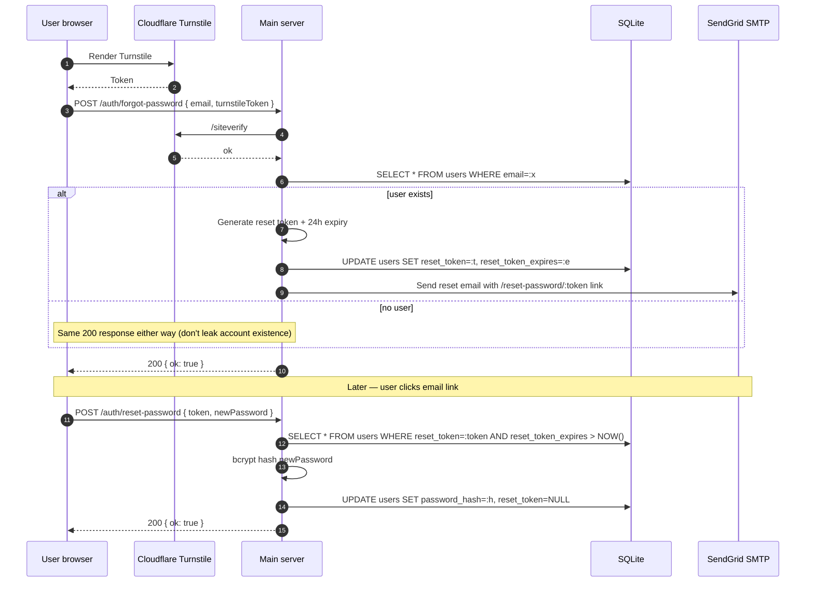

# Authentication flows

_Last verified: 2026-05-23 against commit 4a1d325._

Sequence diagrams for every authentication path OneStreamer supports. See [`threat-model.md`](threat-model.md) for what these defenses are protecting against.

## Email + password signup



## Email + password login



## Google OAuth sign-in



Note: Google-signed-up accounts have `is_verified=true` immediately — Google has already verified the email.

## Password reset



## Account deletion lifecycle

```mermaid
sequenceDiagram
    autonumber
    participant U as User browser
    participant S as Main server
    participant DB as SQLite
    participant E as SendGrid SMTP
    participant Sched as AccountDeletionScheduler

    Note over U: User in Profile Settings → Danger Zone, types "DELETE MY ACCOUNT"
    U->>S: POST /auth/request-deletion (JWT)
    S->>DB: Check is_verified=true
    alt verified
        S->>S: Generate deletion_token (crypto.randomBytes, 24h expiry)
        S->>DB: UPDATE users SET deletion_token=:t, deletion_requested_at=NOW()
        S->>E: Send confirmation email with /confirm-deletion/:token link
        S-->>U: 200 { check email }
    else not verified
        S-->>U: 403 verify email first
    end

    Note over U,E: User clicks confirmation link
    U->>S: POST /auth/confirm-deletion { token }
    S->>DB: SELECT * FROM users WHERE deletion_token=:t AND deletion_token_expires > NOW()
    S->>DB: UPDATE users SET account_status='pending_deletion', deletion_confirmed_at=NOW(), deletion_scheduled_for=NOW()+15days
    S->>DB: INSERT INTO account_deletion_logs (action='confirmed', ip, user_agent)
    S-->>U: 200 { logged out }
    U->>U: Clear tokens

    Note over Sched: Hourly check
    Sched->>DB: SELECT * FROM users WHERE account_status='pending_deletion' AND deletion_confirmed_at IS NOT NULL AND deletion_scheduled_for <= NOW()
    DB-->>Sched: ready-to-delete rows
    Sched->>DB: Wipe 8 tables (user_sessions, user_stats, ip_to_user_transfers, user_inventory, item_usage_history, user_points_log, account_deletion_logs); anonymize users row
    Sched->>DB: INSERT INTO account_deletion_logs (action='permanently_deleted')

    Note over U: Or during grace period — user can restore
    U->>S: POST /auth/restore-account (JWT or email/password)
    S->>DB: UPDATE users SET account_status='active', deletion_* = NULL
    S->>E: Send restoration confirmation email
    S-->>U: 200 { restored }
```

## JWT issuance + refresh

```mermaid
sequenceDiagram
    autonumber
    participant U as User browser
    participant S as Main server
    participant DB as SQLite

    Note over U,S: Initial issuance happens via signup, login, or OAuth callback (see above)
    U->>S: API request with Authorization: Bearer <jwt>
    S->>S: verifyJWT(jwt) — check signature, exp
    alt valid + not banned
        S->>DB: SELECT users WHERE id=:userId; check is_banned, account_status
        S->>S: Handle request
        S-->>U: 200 response
    else expired
        S-->>U: 401 token expired
        U->>S: POST /auth/refresh { refreshToken }
        S->>S: verify refresh token
        S->>S: sign new access + refresh
        S-->>U: { token, refreshToken }
        U->>U: localStorage.setItem
        U->>S: Retry original request
    else invalid signature
        S-->>U: 401 invalid token
        Note over U: Likely JWT_SECRET rotation; user must re-login
    end
```

## Turnstile checkpoint (when triggered)

```mermaid
sequenceDiagram
    autonumber
    participant U as User browser
    participant W as Turnstile widget script
    participant T as Cloudflare Turnstile
    participant S as Main server

    U->>W: Load script tag
    W->>T: Render widget; background challenge
    T-->>W: Challenge completed → token
    W-->>U: Token populated in form field
    U->>S: POST /protected-endpoint { ..., turnstileToken }
    S->>S: extract remoteIp from X-Forwarded-For
    S->>T: POST /siteverify { secret, response: token, remoteip }
    T-->>S: { success, challenge_ts, hostname, 'error-codes': [] }
    alt success + challenge < 5 min old
        S->>S: continue request handling
        S-->>U: 200 / 201
    else failure or expired
        S-->>U: 400 { error: <user-friendly message> }
    end
```

## Notes

- **JWTs are short-lived** (24h) and **refresh tokens are 7-day**. Long-lived sessions require occasional `/auth/refresh` round-trips.
- **The same `JWT_SECRET` is shared** between the main server and the chat-service so tokens issued by main are verifiable on chat. Rotating it logs out every user — see [`/docs/operations/runbooks/secret-rotation.md`](../operations/runbooks/secret-rotation.md).
- **Turnstile token expiry is 5 minutes** — users who linger on a signup form may need to re-challenge.
- **Password-reset response is the same** whether the email exists or not (don't leak account existence).
- **Account-deletion confirmation email** is the only mandatory email-roundtrip in the auth system; signup-verification can be skipped for most features (but is required for account deletion).

## See also

- [`threat-model.md`](threat-model.md) — what these flows defend against
- [`/docs/integrations/google-oauth.md`](../integrations/google-oauth.md) — Google OAuth setup
- [`/docs/integrations/cloudflare-turnstile.md`](../integrations/cloudflare-turnstile.md) — Turnstile setup
- [`/docs/integrations/sendgrid.md`](../integrations/sendgrid.md) — email delivery
- [`/docs/features/admin-panel.md#account-deletion-cross-cutting-feature`](../features/admin-panel.md) — account-deletion details
- [`/docs/api/rest.md`](../api/rest.md) — all auth endpoints reference
